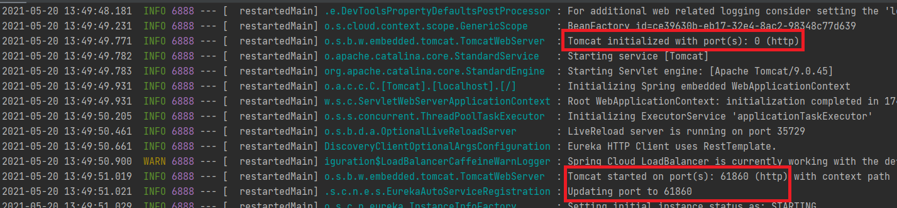
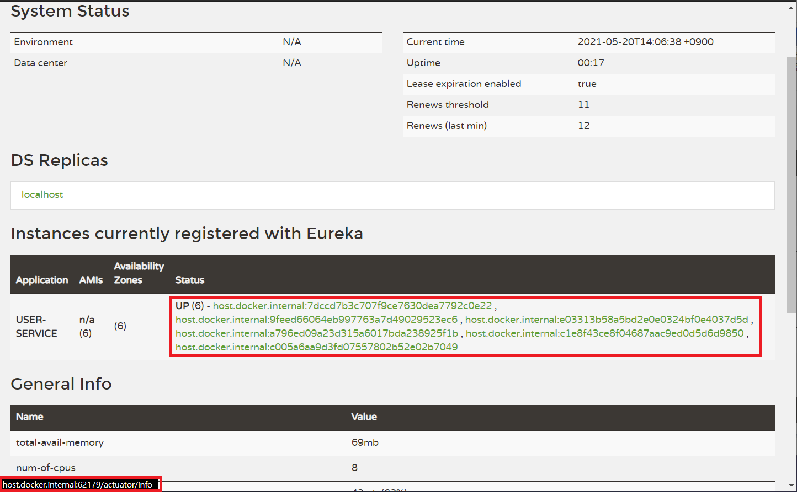

# Service Discovery

<br><br>

## Branch name
step01/service-discovery

<br><br>

# INDEX
### [1. Eureka Service Discovery 프로젝트 생성](#eureka-service-discovery-프로젝트-생성)
  - [1. application.yml 파일 설정](#1-applicationyml-파일-설정)
  - [2. EurekaServer 등록하기](#2-eurekaserver-등록하기)
  - [3. 실행 방법](#3-실행-방법)
### [2. User Service 프로젝트 생성](#user-service-프로젝트-생성)
  - [1. 필요한 Dependency 설치](#1-필요한-dependency-설치)
  - [2. DiscoveryClient 등록하기](#2-discoveryclient-등록하기)
  - [3. application.yml 파일 설정](#3-applicationyml-파일-설정)
  - [4. 실행 방법](#4-실행-방법)
### [3. User Service - Load Balancer](#user-service---load-balancer)
  - [1. application.yml port 변경 및 실행](#1-applicationyml-port-변경-및-실행)


<br><br><br>


# Eureka Service Discovery 프로젝트 생성
## 1. application.yml 파일 설정
```yml
server:
  port: 8761

spring:
  application:
    name: discoveryservice

eureka:
  client:
    register-with-eureka: false
    fetch-registry: false
```

> `eureka.client.register-with-eureka` 와 `eureka.client.fetch-registry` 를 `false` 로 설정하는 이유
>
> 기본적으로 모든 Eureka 서버도 Eureka 클라이언트이며 피어를 찾으려면 서비스 URL이 하나 이상 필요합니다. 서비스를 제공하지 않으면 서비스가 실행되어 작동하지만 피어에 등록할 수 없다는 많은 로그가 발생하므로 위와 같이 설정하면 Standalone Mode로 실행되므로 더이상 로그가 발생하지 않습니다.
>
> ### [Standalone Mode](https://docs.spring.io/spring-cloud-netflix/docs/current/reference/html/#spring-cloud-eureka-server-standalone-mode)

<br><br>

## 2. EurekaServer 등록하기
> `src/main/java/[package]/application.java`
> 파일에 `Eureka Server` 를 등록해줍니다.

```java
package com.msoogle.discoveryservice;

import org.springframework.boot.SpringApplication;
import org.springframework.boot.autoconfigure.SpringBootApplication;
import org.springframework.cloud.netflix.eureka.server.EnableEurekaServer;

@SpringBootApplication
@EnableEurekaServer
public class DiscoveryserviceApplication {

    public static void main(String[] args) {
        SpringApplication.run(DiscoveryserviceApplication.class, args);
    }

}
```

`@EnableEurekaServer` 이 코드에 의해서 프로그램이 자동으로 Eureka 서버의 역할로 스프링 부트로써 사용이 됩니다.

<br><br>

## 3. 실행 방법


빨간색 표시된 부분처럼 실행을 할 수 있습니다.

실행을 하면 `Console` 탭이 열리면서 다음과 같이 `application.yml` 파일에 설정해 두었던 포트 번호로 프로젝트가 실행 됩니다.

```
...
2021-05-19 14:39:55.835  INFO 8526 --- [       Thread-9] c.n.e.r.PeerAwareInstanceRegistryImpl    : Changing status to UP
2021-05-19 14:39:55.851  INFO 8526 --- [           main] o.s.b.w.embedded.tomcat.TomcatWebServer  : Tomcat started on port(s): 8761 (http) with context path ''
2021-05-19 14:39:55.852  INFO 8526 --- [           main] .s.c.n.e.s.EurekaAutoServiceRegistration : Updating port to 8761
2021-05-19 14:39:55.870  INFO 8526 --- [           main] c.m.d.DiscoveryserviceApplication        : Started DiscoveryserviceApplication in 2.739 seconds (JVM running for 3.302)
2021-05-19 14:39:55.870  INFO 8526 --- [       Thread-9] e.s.EurekaServerInitializerConfiguration : Started Eureka Server
2021-05-19 14:40:55.838  INFO 8526 --- [a-EvictionTimer] c.n.e.registry.AbstractInstanceRegistry  : Running the evict task with compensationTime 0ms
```

그리고 웹 브라우저에서 http://localhost:8761 또는 http://127.0.0.1:8761 로 접속하시게 되면 Eureka 서버가 실행된 모습을 확인할 수 있습니다.


<br><br><br>

# User Service 프로젝트 생성

## 1. 필요한 Dependency 설치

- Eureka Discovery Client <br>
- Lombok <br>
- Spring Boot DevTools <br>
- Spring Web <br>


<br><br>

## 2. DiscoveryClient 등록하기
> `src/main/java/[package]/application.java`
> 파일에 `Discovery Client` 를 등록해줍니다.

```java
package com.msoogle.userservice;

import org.springframework.boot.SpringApplication;
import org.springframework.boot.autoconfigure.SpringBootApplication;
import org.springframework.cloud.client.discovery.EnableDiscoveryClient;

@SpringBootApplication
@EnableDiscoveryClient
public class UserServiceApplication {

    public static void main(String[] args) {
        SpringApplication.run(UserServiceApplication.class, args);
    }

}
```

<br><br>

## 3. application.yml 파일 설정

http://127.0.0.1:8761/eureka 엔드 포인트에 현재 `user-service` 마이크로 서비스를 등록하겠다고 설정해줍니다.

```yml
server:
  port: 9001
  
spring:
  application:
    name: user-service

eureka:
  client:
    register-with-eureka: true
    fetch-registry: true
    service-url: 
      defaultZone: http://127.0.0.1:8761/eureka
```

<br><br>

## 4. 실행 방법

> ### [1. Eureka Service Discovery 프로젝트 생성](#eureka-service-discovery-프로젝트-생성) 부분에서 진행항 Eureka Discovery 가 실행 중인 상태여야 합니다.

아까와는 다르게 `Eureka Discovery`에 접속해보면 `USER-SERVICE`가 등록되어 있는 모습을 볼 수 있습니다.


<br><br><br>

# User Service - Load Balancer

> Spring Boot에서 지원해주는 Random port 방법을 사용해서 여러가지의 포트로 Micro service를 실행하는 방법에 대해서 알아 봅니다.

## 1. application.yml port 변경 및 실행

`server.port`를 0으로 해줌으로써 port에 충돌을 의식하지 않을 수 있습니다.

```yml
server:
  port: 0

spring:
  application:
    name: user-service

eureka:
  instance:
    instance-id: ${spring.cloud.client.hostname}:${spring.application.instance_id:${random.value}}
  client:
    register-with-eureka: true
    fetch-registry: true
    service-url:
      defaultZone: http://127.0.0.1:8761/eureka
```

그리고 실행을 해보면 `Console` 창에 다음과 같이 Random으로 port가 설정되어 실행되는 모습을 확인할 수 있습니다.



다음으로 여러개의 `user-service`를 띄운 뒤 Eureka에 접속해서 보게되면 다양한 `host이름`과 `application이름` 등, `application.yml`에서 설정했던 내용이 출력되게 됩니다. 이때 마우스를 호버하게 되면 왼쪽하단에 Random으로 설정된 port를 확인할 수 있습니다.

