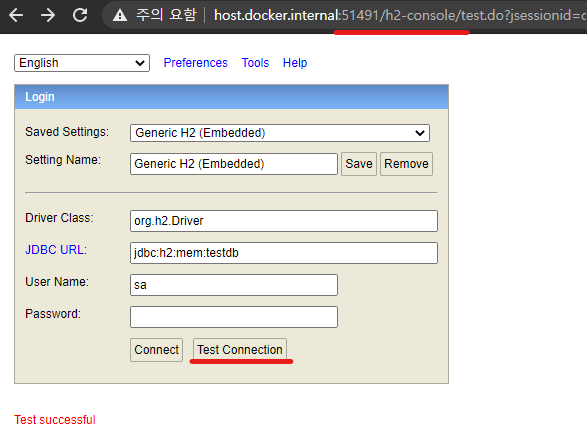
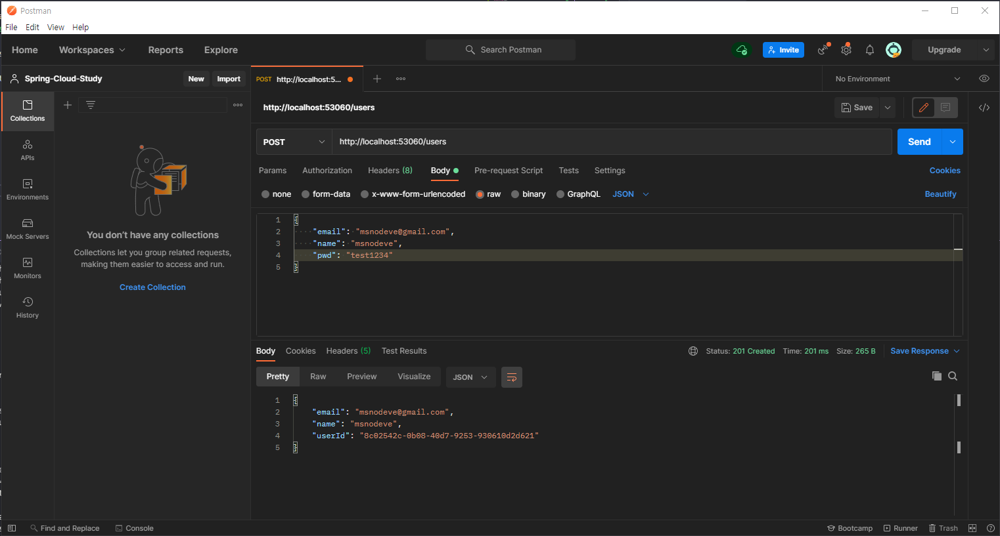
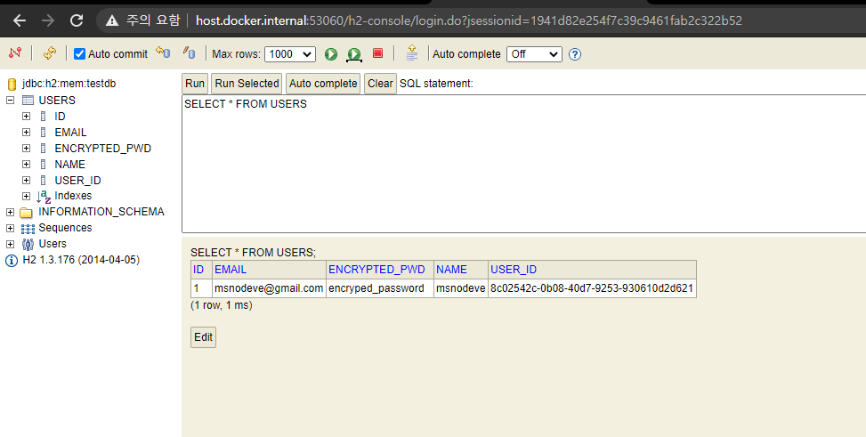
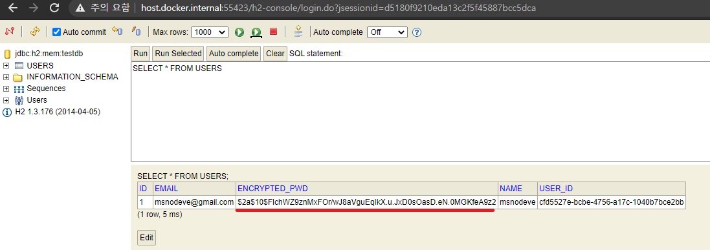

# Users Micro Service

<br><br>

## Branch name
step03/users-microservice

<br><br>

# INDEX

### [2. Users Microservice APIs](#2-users-microservice-apis)
### [3. User Service 프로젝트 생성](#3-user-service-프로젝트-생성)
  - [3.1. application.yml 파일에서 변수 값 들고오는 방법](#31-applicationyml-파일에서-변수-값-들고오는-방법)
    - [3.1.1. application.yml 파일에 변수 생성](#311-applicationyml-파일에-변수-생성)
    - [3.1.2. Environment 사용](#312-environment-사용)
    - [3.1.3. @Value 어노테이션 사용](#313-value-어노테이션-사용)
### [4. H2 Database 연동](#4-h2-database-연동)
  - [4.1. Users Microservice - pom.xml 파일에 Dependency 추가](#41-users-microservice---pomxml-파일에-dependency-추가)
  - [4.2. application.yml 설정](#42-applicationyml-설정)
  - [4.3. 실행 및 접속](#43-실행-및-접속)
### [5. Users Microservice - 사용자 추가](#5-users-microservice---사용자-추가)
  - [5.1. application.yml, pom.xml dependency 추가 및 설정](#51-applicationyml-pomxml-dependency-추가-및-설정)
    - [5.1.1. DTO, VO 클래스 작성](#511-dto-vo-클래스-작성)
    - [5.1.2. jpa 관련](#512-jpa-관련)
    - [5.1.3. Service 구현](#513-service-구현)
    - [5.1.4. Controller 작성](#514-controller-작성)
  - [5.2. 실행](#52-실행)
### [6. Users Microservice - Spring Security 연동](#6-users-microservice---spring-security-연동)
  - [6.1. 설정](#61-설정)
    - [6.1.1. pom.xmld에 Dependency 추가](#611-pomxmld에-dependency-추가)
  - [6.2. WebSecurity Config 설정](#62-websecurity-config-설정)
  - [6.3. CryptPasswordEncoder 설정](#63-cryptpasswordencoder-설정)
  - [6.4. CryptPassword를 사용해서 사용자 Password 저장](#64-cryptpassword를-사용해서-사용자-password-저장)
  - [6.5. 실행](#65-실행)

<br><br><br>

# 2. Users Microservice APIs

| 기능 | URI(API Gateway 사용시) | URI(API Gateway 미사용 시) | HTTP Method |
| --- | --- | --- | --- |
| 사용자 정보 등록 | /user-service/users | /users | POST |
| 전체 사용자 조회 | /user-service/users | /users | GET |
| 사용자 정보, 주문 내역 조회 | /user-service/users/**{user_id}** | /users/**{user_id}** | GET |
| 작동 상태 확인 | /user-service/users/health_check | /users/health_check | GET |
| 환영 메시지 | /user-service/users/welcome | users/welcome | GET |


<br><br>

# 3. User Service 프로젝트 생성

필요한 Dependency 설치
- Lombok <br>
- Spring Web <br>
- Eureka Discovery Client <br>
- Spring Boot DevTools <br>

<br><br>

## 3.1. application.yml 파일에서 변수 값 들고오는 방법

### 3.1.1. application.yml 파일에 변수 생성
```yml
server:
  port: 0

spring:
  application:
    name: user-service

eureka:
  instance:
    instance-id: ${spring.application.name}:${spring.application.instance_id:${random.value}}
  client:
    register-with-eureka: true
    fetch-registry: true
    service-url:
      defaultZone: http://127.0.0.1:8761/eureka

greeting:
  message: Welcome to the Simple E-commerce.
```

### 3.1.2. Environment 사용

```java
import org.springframework.core.env.Environment;
import org.springframework.web.bind.annotation.GetMapping;
import org.springframework.web.bind.annotation.RequestMapping;
import org.springframework.web.bind.annotation.RestController;

@RestController
@RequestMapping("/")
public class UserController {

    private Environment env;

    @Autowired
    public UserController(Environment env) {
        this.env = env;
    }

    @GetMapping("/health_check")
    public String status() {
        return "It's Working in User Service.";
    }

    @GetMapping("/welcome")
    public String welcome() {
       return env.getProperty("greeting.message");
    }
}
```

### 3.1.3. @Value 어노테이션 사용

`[package]/vo/Greeting.java` 파일 생성 및 작성

```java
import lombok.Data;
import org.springframework.beans.factory.annotation.Value;
import org.springframework.stereotype.Component;

@Data
@Component
public class Greeting {
    @Value("${greeting.message}")
    private String message;
}
```

```java
import com.msoogle.userservice.vo.Greeting;
import org.springframework.beans.factory.annotation.Autowired;
import org.springframework.web.bind.annotation.GetMapping;
import org.springframework.web.bind.annotation.RequestMapping;
import org.springframework.web.bind.annotation.RestController;

@RestController
@RequestMapping("/")
public class UserController {

    @Autowired
    private Greeting greeting;

    @GetMapping("/health_check")
    public String status() {
        return "It's Working in User Service.";
    }

    @GetMapping("/welcome")
    public String welcome() {
        return greeting.getMessage();
    }
}
```

<br><br><br>

# 4. H2 Database 연동

## 4.1. Users Microservice - pom.xml 파일에 Dependency 추가

> [H2 Maven Repository](https://mvnrepository.com/artifact/com.h2database/h2) 여기서 원하는 버전을 선택

```yml
...
<!-- https://mvnrepository.com/artifact/com.h2database/h2 -->
<dependency>
    <groupId>com.h2database</groupId>
    <artifactId>h2</artifactId>
    <version>1.3.176</version>
    <scope>runtime</scope>
</dependency>
...
```

> 참고) 1.4.x 버전에서는 보안상 console에서 db를 생성할 수 없기 때문에, 1.3.x 버전으로 하는 것을 추천

<br><br>

## 4.2. application.yml 설정
```yml
...
spring:
  application:
    name: user-service
  h2:
    console:
      enabled: true
      settings:
        web-allow-others: true
      path: /h2-console
...
```

<br><br>

## 4.3. 실행 및 접속




<br><br><br>

# 5. Users Microservice - 사용자 추가

## 5.1. application.yml, pom.xml dependency 추가 및 설정

```yml
server:
  port: 0

spring:
  application:
    name: user-service
  h2:
    console:
      enabled: true
      settings:
        web-allow-others: true
      path: /h2-console
  datasource:
    driver-class-name: org.h2.Driver
    url: jdbc:h2:mem:testdb

eureka:
  instance:
    instance-id: ${spring.application.name}:${spring.application.instance_id:${random.value}}
  client:
    register-with-eureka: true
    fetch-registry: true
    service-url:
      defaultZone: http://127.0.0.1:8761/eureka

greeting:
  message: Welcome to the Simple E-commerce.
```

```xml
...
<!-- Java 객체로 Database를 사용하기 위해 jpa 사용 -->
<dependency>
    <groupId>org.springframework.boot</groupId>
    <artifactId>spring-boot-starter-data-jpa</artifactId>
</dependency>

<!-- 원하는 Dto, VO 객체로 쉽게 변환시키기 위해 사용-->
<dependency>
    <groupId>org.modelmapper</groupId>
    <artifactId>modelmapper</artifactId>
    <version>2.3.8</version>
</dependency>
...
```

<br>

### 5.1.1. DTO, VO 클래스 작성
```java
// UserDto.java
import lombok.Data;

import java.util.Date;

@Data
public class UserDto {
    private String email;
    private String name;
    private String pwd;
    private String userId;
    private Date createdAt;

    private String encryptedPwd;
}
```

```java
// RequestUser.java
import lombok.Data;

import javax.validation.constraints.Email;
import javax.validation.constraints.NotNull;
import javax.validation.constraints.Size;

@Data
public class RequestUser {
    @NotNull(message = "Email cannot be null")
    @Size(min = 2, message = "Email not be less than two characters")
    @Email
    private String email;

    @NotNull(message = "Name cannot be null")
    @Size(min = 2, message = "Name not be less than two characters")
    private String name;

    @NotNull(message = "Password cannot be null")
    @Size(min = 8, message = "Password must be equal or grater than 8")
    private String pwd;
}

```

```java
// ResponseUser.java
import lombok.Data;

@Data
public class ResponseUser {
    private String email;
    private String name;
    private String userId;
}
```

### 5.1.2. jpa 관련

```java
// UserEntity.java
import lombok.Data;

import javax.persistence.*;

@Data
@Entity
@Table(name = "users")
public class UserEntity {
    @Id
    @GeneratedValue(strategy = GenerationType.IDENTITY)
    private Long id;

    @Column(nullable = false, length = 50, unique = true)
    private String email;
    @Column(nullable = false, length = 50)
    private String name;
    @Column(nullable = false, unique = true)
    private String userId;
    @Column(nullable = false, unique = true)
    private String encryptedPwd;
}
```

```java
// UserRepository.java
import org.springframework.data.repository.CrudRepository;

public interface UserRepository extends CrudRepository<UserEntity, Long> {

}
```

### 5.1.3. Service 구현

```java
// UserService.java
import com.msoogle.userservice.dto.UserDto;

public interface UserService {
    UserDto createUser(UserDto userDto);
}
```

```java
// UserServiceImpl.java
import com.msoogle.userservice.dto.UserDto;
import com.msoogle.userservice.jpa.UserEntity;
import com.msoogle.userservice.jpa.UserRepository;
import org.modelmapper.ModelMapper;
import org.modelmapper.convention.MatchingStrategies;
import org.modelmapper.spi.MatchingStrategy;
import org.springframework.beans.factory.annotation.Autowired;
import org.springframework.stereotype.Service;

import java.util.UUID;

@Service
public class UserServiceImpl implements UserService{

    @Autowired
    UserRepository userRepository;

    @Override
    public UserDto createUser(UserDto userDto) {
        userDto.setUserId(UUID.randomUUID().toString());

        ModelMapper mapper = new ModelMapper();
        mapper.getConfiguration().setMatchingStrategy(MatchingStrategies.STRICT);
        UserEntity userEntity = mapper.map(userDto, UserEntity.class);
        userEntity.setEncryptedPwd("encryped_password");

        userRepository.save(userEntity);

        UserDto returnUserDto = mapper.map(userEntity, UserDto.class);

        return returnUserDto;
    }
}
```

### 5.1.4. Controller 작성

```java
// UserController.java
import com.msoogle.userservice.dto.UserDto;
import com.msoogle.userservice.service.UserService;
import com.msoogle.userservice.vo.Greeting;
import com.msoogle.userservice.vo.RequestUser;
import com.msoogle.userservice.vo.ResponseUser;
import org.modelmapper.ModelMapper;
import org.modelmapper.convention.MatchingStrategies;
import org.springframework.beans.factory.annotation.Autowired;
import org.springframework.core.env.Environment;
import org.springframework.http.HttpStatus;
import org.springframework.http.ResponseEntity;
import org.springframework.ui.ModelMap;
import org.springframework.web.bind.annotation.*;

@RestController
@RequestMapping("/")
public class UserController {

    private UserService userService;

    @Autowired
    public UserController(UserService userService) {
        this.userService = userService;
    }

    @PostMapping("/users")
    public ResponseEntity<ResponseUser> createUser(@RequestBody RequestUser user) {
        ModelMapper mapper = new ModelMapper();
        mapper.getConfiguration().setMatchingStrategy(MatchingStrategies.STRICT);

        UserDto userDto = mapper.map(user, UserDto.class);
        userService.createUser(userDto);

        ResponseUser responseUser = mapper.map(userDto, ResponseUser.class);

        return ResponseEntity.status(HttpStatus.CREATED).body(responseUser);
    }
}
```

<br><br>

## 5.2. 실행



> User MicroService의 port를 확인한 뒤, PostMan 프로그램으로 실행합니다. <br>
> POST, http://localhost:[port]/users <br>
> Body > raw > JSON 타입으로 그림과 같이 형식에 맞춰 요청을 보냅니다. <br>
> 받아온 결과 값을 확인한 뒤, h2-console 창에 접속해서 확인합니다. <br>



<br><br><br>


# 6. Users Microservice - Spring Security 연동

## 6.1. 설정

### 6.1.1. pom.xmld에 Dependency 추가
```xml
...
<dependency>
    <groupId>org.springframework.boot</groupId>
    <artifactId>spring-boot-starter-security</artifactId>
</dependency>
...
```

## 6.2. WebSecurity Config 설정
```java
import org.springframework.context.annotation.Configuration;
import org.springframework.security.config.annotation.web.builders.HttpSecurity;
import org.springframework.security.config.annotation.web.configuration.EnableWebSecurity;
import org.springframework.security.config.annotation.web.configuration.WebSecurityConfigurerAdapter;

@Configuration
@EnableWebSecurity
public class WebSecurity extends WebSecurityConfigurerAdapter {
    @Override
    protected void configure(HttpSecurity http) throws Exception {
        http.csrf().disable();
        http.authorizeRequests().antMatchers("/users/**").permitAll();

        http.headers().frameOptions().disable(); // h2-console 접속 에러 문제 해결
    }
}
```

<br><br>

## 6.3. CryptPasswordEncoder 설정

> Application이 실행되는 최상단에 BCryptPasswordEncoder를 Bean으로 등록합니다.

```java
// Application.java

@Bean
public BCryptPasswordEncoder passwordEncoder(){
    return new BCryptPasswordEncoder();
}
```

## 6.4. CryptPassword를 사용해서 사용자 Password 저장

> Password를 암호화 하고 있는 곳에서 코드를 작성합니다.

```java
// UserServiceImpl.java

import com.msoogle.userservice.dto.UserDto;
import com.msoogle.userservice.jpa.UserEntity;
import com.msoogle.userservice.jpa.UserRepository;
import org.modelmapper.ModelMapper;
import org.modelmapper.convention.MatchingStrategies;
import org.modelmapper.spi.MatchingStrategy;
import org.springframework.beans.factory.annotation.Autowired;
import org.springframework.security.crypto.bcrypt.BCryptPasswordEncoder;
import org.springframework.stereotype.Service;

import java.util.UUID;

@Service
public class UserServiceImpl implements UserService{
    UserRepository userRepository;
    BCryptPasswordEncoder passwordEncoder; // 생성자로 자동 주입

    @Autowired
    public UserServiceImpl(UserRepository userRepository, BCryptPasswordEncoder passwordEncoder){
        this.userRepository = userRepository;
        this.passwordEncoder = passwordEncoder;
    }

    @Override
    public UserDto createUser(UserDto userDto) {
        userDto.setUserId(UUID.randomUUID().toString());

        ModelMapper mapper = new ModelMapper();
        mapper.getConfiguration().setMatchingStrategy(MatchingStrategies.STRICT);
        UserEntity userEntity = mapper.map(userDto, UserEntity.class);
        userEntity.setEncryptedPwd(passwordEncoder.encode(userDto.getPwd())); // 암호화 적용

        userRepository.save(userEntity);

        UserDto returnUserDto = mapper.map(userEntity, UserDto.class);

        return returnUserDto;
    }
}
```

## 6.5. 실행

[5.2. 실행](#52-실행) 이 부분과 동일하게 실행하고 `h2-console`에 접속해보면 다음과 같이 암호화해서 Database에 들어간 모습을 확인할 수 있습니다.

