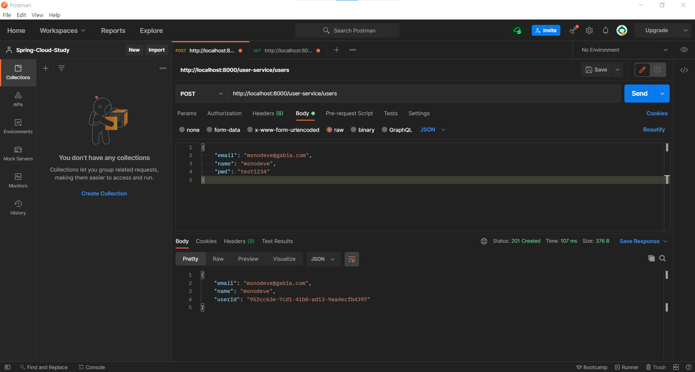

# Catalogs and Orders Microservice

<br><br>

## Branch name
step04/catalogs-and-orders-microservice

<br><br>

# INDEX

### [1. 사용자 조회 구현](#1-사용자-조회-구현)
  - [1.1. API Gateway 설정](#11-api-gateway-설정)
  - [1.2. User Service, DTO, VO 수정](#12-user-service-dto-vo-수정)
  - [1.3. 사용자 단일 조회 및 전체 조회 구현](#13-사용자-단일-조회-및-전체-조회-구현)
  - [1.4. 실행](#14-실행)
### [2. Catalog MicroServie 생성 및 기능 구현](#2-catalog-microservie-생성-및-기능-구현)
  - [2.1. 새 프로젝트 생성 및 Dependency 추가](#21-새-프로젝트-생성-및-dependency-추가)
  - [2.2. API Gateway 설정](#22-api-gateway-설정)
  - [2.3. Catalog Service application.yml 설정](#23-catalog-service-applicationyml-설정)
  - [2.4. data.sql 파일 생성](#24-datasql-파일-생성)
  - [2.5. DTO, VO 파일 생성 및 구현](#25-dto-vo-파일-생성-및-구현)
  - [2.6. JPA Entity, Repository 생성 및 구현](#26-jpa-entity-repository-생성-및-구현)
  - [2.7. Service 생성 및 구현](#27-service-생성-및-구현)
  - [2.8. Controller 생성 및 구현](#28-controller-생성-및-구현)
  - [2.9. 실행](#29-실행)
### [3. Order MicroServie 생성 및 기능 구현](#3-order-microservie-생성-및-기능-구현)
  - [3.1. 새 프로젝트 생성 및 Dependency 추가](#31-새-프로젝트-생성-및-dependency-추가)
  - [3.2. API Gateway 설정](#32-api-gateway-설정)
  - [3.3. Order Service application.yml 설정](#33-order-service-applicationyml-설정)
  - [3.4. DTO, VO 파일 생성 및 구현](#34-dto-vo-파일-생성-및-구현)
  - [3.5. JPA Entity, Repository 생성 및 구현](#35-jpa-entity-repository-생성-및-구현)
  - [3.6. Service 생성 및 구현](#36-service-생성-및-구현)
  - [3.7. Controller 생성 및 구현](#37-controller-생성-및-구현)
  - [3.8. 실행](#38-실행)

<br><br>

# 1. 사용자 조회 구현

## 1.1. API Gateway 설정

1. application.yml 파일 수정
 
> user-service application 설정 및 로드밸런싱 설정

```yml
...
spring:
  application:
    name: apigateway-service
  cloud:
    gateway:
      routes:
        - id: user-service
          uri: lb://USER-SERVICE
          predicates:
            - Path=/user-service/**
...
```

<br><br>

## 1.2. User Service, DTO, VO 수정
```java
// UserDto.java

import com.msoogle.userservice.vo.ResponseOrder;
import lombok.Data;

import java.util.Date;
import java.util.List;

@Data
public class UserDto {
    private String email;
    private String name;
    private String pwd;
    private String userId;
    private Date createdAt;

    private String encryptedPwd;

    private List<ResponseOrder> orders;
}
```

```java
// ResponseOrder.java

import lombok.Data;

import java.util.Date;

@Data
public class ResponseOrder {
    private String productId;
    private Integer qty;
    private Integer unitPrice;
    private Integer totalPrice;
    private Date createdAt;

    private String orderId;
}
```

```java
// ResponseUser.java

import com.fasterxml.jackson.annotation.JsonInclude;
import lombok.Data;

import java.util.List;

@Data
@JsonInclude(JsonInclude.Include.NON_NULL)
public class ResponseUser {
    private String email;
    private String name;
    private String userId;

    private List<ResponseOrder> orders;
}
```

`@JsonInclude(JsonInclude.Include.NON_NULL)`

> Json 타입으로 요청을 받을 경우 Null로 데이터를 받을 때는 해당 변수는 제외하고 받겠다는 의미를 갖고 있는 어노테이션 입니다.

<br><br>

## 1.3. 사용자 단일 조회 및 전체 조회 구현

```java
// UserRepository.java

import org.springframework.data.repository.CrudRepository;

public interface UserRepository extends CrudRepository<UserEntity, Long> {
    UserEntity findByUserId(String userId);
}
```

> JPA를 사용했기 때문에 findByUserId를 다음과 같이 SQL 쿼리문으로 변경해서 수행<br>
> find : SELECT * (UserEntity 컬럼들) FROM UserEntity<br>
> By : WHERE<br>
> UserId : user_id = UserId (String userId 값으로 대체)<br>

```java
// UserService.java

import com.msoogle.userservice.dto.UserDto;
import com.msoogle.userservice.jpa.UserEntity;

public interface UserService {
    UserDto createUser(UserDto userDto);

    UserDto getUserByUserId(String userId);
    Iterable<UserEntity> getUserByAll();
}
```

> createUser 메서드는 이전 시간에 생성해 두었으므로, <br>
> 사용자 단일 조회, 사용자 전체 조회 하는 메서드를 interface에 작성 <br>

```java
// UserServiceImpl.java

import com.msoogle.userservice.dto.UserDto;
import com.msoogle.userservice.jpa.UserEntity;
import com.msoogle.userservice.jpa.UserRepository;
import com.msoogle.userservice.vo.ResponseOrder;
import org.modelmapper.ModelMapper;
import org.modelmapper.convention.MatchingStrategies;
import org.springframework.beans.factory.annotation.Autowired;
import org.springframework.security.core.userdetails.UsernameNotFoundException;
import org.springframework.security.crypto.bcrypt.BCryptPasswordEncoder;
import org.springframework.stereotype.Service;

import java.util.ArrayList;
import java.util.List;
import java.util.UUID;

@Service
public class UserServiceImpl implements UserService{
    UserRepository userRepository;
    BCryptPasswordEncoder passwordEncoder;

    @Autowired
    public UserServiceImpl(UserRepository userRepository, BCryptPasswordEncoder passwordEncoder){
        this.userRepository = userRepository;
        this.passwordEncoder = passwordEncoder;
    }

    // createUser Method...

    @Override
    public UserDto getUserByUserId(String userId) {
        UserEntity userEntity = userRepository.findByUserId(userId);

        if(userEntity == null){
            throw new UsernameNotFoundException("User not found");
        }

        UserDto userDto = new ModelMapper().map(userEntity, UserDto.class);

        List<ResponseOrder> orders = new ArrayList<>();
        userDto.setOrders(orders);

        return userDto;
    }

    @Override
    public Iterable<UserEntity> getUserByAll() {
        return userRepository.findAll();
    }
}
```

> 비즈니스 로직 구현

```java
// UserController.java

import com.msoogle.userservice.dto.UserDto;
import com.msoogle.userservice.jpa.UserEntity;
import com.msoogle.userservice.service.UserService;
import com.msoogle.userservice.vo.Greeting;
import com.msoogle.userservice.vo.RequestUser;
import com.msoogle.userservice.vo.ResponseUser;
import org.modelmapper.ModelMapper;
import org.modelmapper.convention.MatchingStrategies;
import org.springframework.beans.factory.annotation.Autowired;
import org.springframework.core.env.Environment;
import org.springframework.http.HttpStatus;
import org.springframework.http.ResponseEntity;
import org.springframework.web.bind.annotation.*;

import java.util.ArrayList;
import java.util.List;

@RestController
@RequestMapping("/user-service/")
public class UserController {

    private Environment env;
    private UserService userService;

    @Autowired
    private Greeting greeting;

    @Autowired
    public UserController(Environment env, UserService userService) {
        this.env = env;
        this.userService = userService;
    }

    // createUser Method...

    @GetMapping("/users")
    public ResponseEntity<List<ResponseUser>> getUsers() {
        Iterable<UserEntity> userList = userService.getUserByAll();

        List<ResponseUser> result = new ArrayList<>();

        userList.forEach(v -> {
            result.add(new ModelMapper().map(v, ResponseUser.class));
        });

        return ResponseEntity.status(HttpStatus.OK).body(result);
    }

    @GetMapping("/users/{userId}")
    public ResponseEntity<ResponseUser> getUser(@PathVariable String userId) {
        UserDto userDto = userService.getUserByUserId(userId);

        ResponseUser resultValue = new ModelMapper().map(userDto, ResponseUser.class);

        return ResponseEntity.status(HttpStatus.OK).body(resultValue);
    }
}
```

<br><br>

## 1.4. 실행

1. http://localhost:8000/user-service/users url로 POST 요청
2. Body > raw > JSON 형식으로 데이터 전송
   ```json
   {
    "email": "test@gmail.com",
    "name": "test",
    "pwd": "test1234"
   }
   ```
   
3. 이외 다른 email로 2개 정도 요청을 보냄
4. http://localhost:8000/user-service/users url로 GET 요청
   
5. 사용자 단일 요청을 하기 위해 검색된 내용 중 아무 userId를 복사
6. http://localhost:8000/user-service/users/{userId} url로 GET 요청
   


<br><br><br>

# 2. Catalog MicroServie 생성 및 기능 구현

## 2.1. 새 프로젝트 생성 및 Dependency 추가

catalog-service 이름으로 프로젝트 생성

- Eureka Discovery Client <br>
- Lombok <br>
- Spring Boot DevTools <br>
- Spring Web <br>
- Spring Data JPA <br>
- H2 Database <br>


> H2 Database version은 1.3.x 버전으로 변경 <br>
> ModelMapper Dependency 추가 <br>

<br>

## 2.2. API Gateway 설정

1. application.yml 파일 수정
 
> catalog-service application 설정 및 로드밸런싱 설정

```yml
...
spring:
  application:
    name: apigateway-service
  cloud:
    gateway:
      routes:
        - id: catalog-service
          uri: lb://CATALOG-SERVICE
          predicates:
            - Path=/catalog-service/**
...
```

## 2.3. Catalog Service application.yml 설정

```yml
server:
  port: 0

spring:
  application:
    name: catalog-service
  h2:
    console:
      enabled: true
      settings:
        web-allow-others: true
      path: /h2-console
  datasource:
    driver-class-name: org.h2.Driver
    url: jdbc:h2:mem:testdb
  jpa:
    hibernate:
      ddl-auto: create-drop
    show-sql: true
    generate-ddl: true

eureka:
  instance:
    instance-id: ${spring.application.name}:${spring.application.instance_id:${random.value}}
  client:
    register-with-eureka: true
    fetch-registry: true
    service-url:
      defaultZone: http://127.0.0.1:8761/eureka

logging:
  level:
    com.msoogle.catalogservice: DEBUG
```

<br>

## 2.4. data.sql 파일 생성

> 본 프로젝트 실행과 동시에 데이터가 입력되어있는 상태로 시작하기 위해 작성 <br>
> `resources/data.sql` 파일 생성

```sql
insert into catalog(product_id, product_name, stock, unit_price) values('CATALOG-001', 'Berlin', 100, 1500);
insert into catalog(product_id, product_name, stock, unit_price) values('CATALOG-002', 'Tokyo', 110, 1000);
insert into catalog(product_id, product_name, stock, unit_price) values('CATALOG-003', 'Stockholm', 120, 2000);
```

<br>

## 2.5. DTO, VO 파일 생성 및 구현

```java
// CatalogDto.java

import lombok.Data;

import java.io.Serializable;

@Data
public class CatalogDto implements Serializable {
    private String productId;
    private Integer qty;
    private Integer unitPrice;
    private Integer totalPrice;

    private String orderId;
    private String userId;
}
```

```java
// ResponseCatalog.java

import com.fasterxml.jackson.annotation.JsonInclude;
import lombok.Data;

import java.util.Date;

@Data
@JsonInclude(JsonInclude.Include.NON_NULL)
public class ResponseCatalog {
    private String productId;
    private String productName;
    private Integer unitPrice;
    private Integer stock;

    private Date createdAt;
}
```

<br>

## 2.6. JPA Entity, Repository 생성 및 구현

```java
// CatalogEntity.java

import lombok.Data;
import org.hibernate.annotations.ColumnDefault;

import javax.persistence.*;
import java.io.Serializable;
import java.util.Date;

@Data
@Entity
@Table(name = "catalog")
public class CatalogEntity implements Serializable {
    @Id
    @GeneratedValue(strategy = GenerationType.IDENTITY)
    private Long id;

    @Column(nullable = false, length = 120, unique = true)
    private String productId;
    @Column(nullable = false)
    private String productName;
    @Column(nullable = false)
    private Integer stock;
    @Column(nullable = false)
    private Integer unitPrice;

    @Column(nullable = false, updatable = false, insertable = false)
    @ColumnDefault(value = "CURRENT_TIMESTAMP")
    private Date createdAt;
}
```

```java
// CatalogRepository.java

import org.springframework.data.repository.CrudRepository;

public interface CatalogRepository extends CrudRepository<CatalogEntity, Long> {
    CatalogEntity findByProductId(String productId);
}
```

<br>

## 2.7. Service 생성 및 구현

```java
// CatalogService.java

import com.msoogle.catalogservice.jpa.CatalogEntity;

public interface CatalogService {
    Iterable<CatalogEntity> getAllCatalogs();
}
```

```java
// CatalogServiceImpl.java

import com.msoogle.catalogservice.jpa.CatalogEntity;
import com.msoogle.catalogservice.jpa.CatalogRepository;
import lombok.Data;
import lombok.extern.slf4j.Slf4j;
import org.springframework.beans.factory.annotation.Autowired;
import org.springframework.stereotype.Service;

@Data
@Slf4j
@Service
public class CatalogServiceImpl implements CatalogService{

    CatalogRepository catalogRepository;

    @Autowired
    public CatalogServiceImpl(CatalogRepository catalogRepository) {
        this.catalogRepository = catalogRepository;
    }

    @Override
    public Iterable<CatalogEntity> getAllCatalogs() {
        return catalogRepository.findAll();
    }
}
```

<br>

## 2.8. Controller 생성 및 구현

```java
// CatalogController.java

import com.msoogle.catalogservice.jpa.CatalogEntity;
import com.msoogle.catalogservice.service.CatalogService;
import com.msoogle.catalogservice.vo.ResponseCatalog;
import org.modelmapper.ModelMapper;
import org.springframework.beans.factory.annotation.Autowired;
import org.springframework.core.env.Environment;
import org.springframework.http.HttpStatus;
import org.springframework.http.ResponseEntity;
import org.springframework.web.bind.annotation.GetMapping;
import org.springframework.web.bind.annotation.RequestMapping;
import org.springframework.web.bind.annotation.RestController;

import java.util.ArrayList;
import java.util.List;

@RestController
@RequestMapping("/catalog-service")
public class CatalogController {
    Environment env;
    CatalogService catalogService;

    @Autowired
    public CatalogController(Environment env, CatalogService catalogService) {
        this.env = env;
        this.catalogService = catalogService;
    }

    @GetMapping("/health_check")
    public String status() {
        return String.format("It's Working in Catalog Service on PORT %s", env.getProperty("local.server.port"));
    }

    @GetMapping("/catalogs")
    public ResponseEntity<List<ResponseCatalog>> getCatalogs() {
        Iterable<CatalogEntity> catalogList = catalogService.getAllCatalogs();

        List<ResponseCatalog> result = new ArrayList<>();

        catalogList.forEach(v -> {
            result.add(new ModelMapper().map(v, ResponseCatalog.class));
        });

        return ResponseEntity.status(HttpStatus.OK).body(result);
    }
}
```

<br><br>

## 2.9. 실행

http://localhost:8000/catalog-service/catalogs url로 GET 요청


<br><br><br>

# 3. Order MicroServie 생성 및 기능 구현

## 3.1. 새 프로젝트 생성 및 Dependency 추가

order-service 이름으로 프로젝트 생성

- Eureka Discovery Client <br>
- Lombok <br>
- Spring Boot DevTools <br>
- Spring Web <br>
- Spring Data JPA <br>
- H2 Database <br>


> H2 Database version은 1.3.x 버전으로 변경 <br>
> ModelMapper Dependency 추가 <br>

<br>

## 3.2. API Gateway 설정

1. application.yml 파일 수정
 
> order-service application 설정 및 로드밸런싱 설정

```yml
...
spring:
  application:
    name: apigateway-service
  cloud:
    gateway:
      routes:
        - id: order-service
          uri: lb://ORDER-SERVICE
          predicates:
            - Path=/order-service/**
...
```

## 3.3. Order Service application.yml 설정

```yml
server:
  port: 0

spring:
  application:
    name: order-service
  h2:
    console:
      enabled: true
      settings:
        web-allow-others: true
      path: /h2-console
  datasource:
    driver-class-name: org.h2.Driver
    url: jdbc:h2:mem:testdb
  jpa:
    hibernate:
      ddl-auto: update
    show-sql: true
    generate-ddl: true

eureka:
  instance:
    instance-id: ${spring.application.name}:${spring.application.instance_id:${random.value}}
  client:
    register-with-eureka: true
    fetch-registry: true
    service-url:
      defaultZone: http://127.0.0.1:8761/eureka

logging:
  level:
    com.msoogle.catalogservice: DEBUG
```

<br>

## 3.4. DTO, VO 파일 생성 및 구현

```java
// OrderDto.java

import lombok.Data;

import java.io.Serializable;

@Data
public class OrderDto implements Serializable {
    private String productId;
    private Integer qty;
    private Integer unitPrice;
    private Integer totalPrice;

    private String orderId;
    private String userId;
}
```

```java
// ResponseOrder.java

import com.fasterxml.jackson.annotation.JsonInclude;
import lombok.Data;

import java.util.Date;

@Data
@JsonInclude(JsonInclude.Include.NON_NULL)
public class ResponseOrder {
    private String productId;
    private Integer qty;
    private Integer unitPrice;
    private Integer totalPrice;

    private Date createdAt;
    private String orderId;
}
```

```java
// RequestOrder.java

import lombok.Data;

@Data
public class RequestOrder {
    private String productId;
    private Integer qty;
    private Integer unitPrice;
}
```

<br>

## 3.5. JPA Entity, Repository 생성 및 구현

```java
// OrderEntity.java

import lombok.Data;
import org.hibernate.annotations.ColumnDefault;

import javax.persistence.*;
import java.io.Serializable;
import java.util.Date;

@Data
@Entity
@Table(name = "orders")
public class OrderEntity implements Serializable {
    @Id
    @GeneratedValue(strategy = GenerationType.IDENTITY)
    private Long id;

    @Column(nullable = false, length = 120, unique = true)
    private String productId;
    @Column(nullable = false)
    private Integer qty;
    @Column(nullable = false)
    private Integer unitPrice;
    @Column(nullable = false)
    private Integer totalPrice;

    @Column(nullable = false)
    private String userId;
    @Column(nullable = false, unique = true)
    private String orderId;

    @Column(nullable = false, updatable = false, insertable = false)
    @ColumnDefault(value = "CURRENT_TIMESTAMP")
    private Date createdAt;
}
```

```java
// OrderRepository.java

import org.springframework.data.repository.CrudRepository;

public interface OrderRepository extends CrudRepository<OrderEntity, Long> {

    OrderEntity findByOrderId(String orderId);

    Iterable<OrderEntity> findByUserId(String userId);
}
```

<br>

## 3.6. Service 생성 및 구현

```java
// OrderService.java

import com.msoogle.orderservice.dto.OrderDto;
import com.msoogle.orderservice.jpa.OrderEntity;

public interface OrderService {
    OrderDto createOrder(OrderDto orderDetails);

    OrderDto getOrderByOrderId(String orderId);

    Iterable<OrderEntity> getOrdersByUserId(String userId);
}

```

```java
// OrderServiceImpl.java

import com.msoogle.orderservice.dto.OrderDto;
import com.msoogle.orderservice.jpa.OrderEntity;
import com.msoogle.orderservice.jpa.OrderRepository;
import org.modelmapper.ModelMapper;
import org.modelmapper.convention.MatchingStrategies;
import org.springframework.beans.factory.annotation.Autowired;
import org.springframework.stereotype.Service;

import java.util.UUID;

@Service
public class OrderServiceImpl implements OrderService {

    OrderRepository orderRepository;

    @Autowired
    public OrderServiceImpl(OrderRepository orderRepository) {
        this.orderRepository = orderRepository;
    }

    @Override
    public OrderDto createOrder(OrderDto orderDetails) {
        orderDetails.setOrderId(UUID.randomUUID().toString());
        orderDetails.setTotalPrice(orderDetails.getUnitPrice() * orderDetails.getQty());

        ModelMapper mapper = new ModelMapper();
        mapper.getConfiguration().setMatchingStrategy(MatchingStrategies.STRICT);
        OrderEntity orderEntity = mapper.map(orderDetails, OrderEntity.class);

        orderRepository.save(orderEntity);

        OrderDto returnValue = mapper.map(orderEntity, OrderDto.class);

        return returnValue;
    }

    @Override
    public OrderDto getOrderByOrderId(String orderId) {
        OrderEntity orderEntity = orderRepository.findByOrderId(orderId);
        OrderDto orderDto = new ModelMapper().map(orderEntity, OrderDto.class);

        return orderDto;
    }

    @Override
    public Iterable<OrderEntity> getOrdersByUserId(String userId) {
        return orderRepository.findByUserId(userId);
    }
}
```

<br>

## 3.7. Controller 생성 및 구현

```java
// OrderController.java

import com.msoogle.orderservice.dto.OrderDto;
import com.msoogle.orderservice.jpa.OrderEntity;
import com.msoogle.orderservice.service.OrderService;
import com.msoogle.orderservice.vo.RequestOrder;
import com.msoogle.orderservice.vo.ResponseOrder;
import org.modelmapper.ModelMapper;
import org.modelmapper.convention.MatchingStrategies;
import org.springframework.beans.factory.annotation.Autowired;
import org.springframework.core.env.Environment;
import org.springframework.http.HttpStatus;
import org.springframework.http.ResponseEntity;
import org.springframework.web.bind.annotation.*;

import java.util.ArrayList;
import java.util.List;

@RestController
@RequestMapping("/order-service")
public class OrderController {
    Environment env;
    OrderService orderService;

    @Autowired
    public OrderController(Environment env, OrderService orderService) {
        this.env = env;
        this.orderService = orderService;
    }

    @GetMapping("/health_check")
    public String status() {
        return String.format("It's Working in Order Service on PORT %s", env.getProperty("local.server.port"));
    }

    @PostMapping("/{userId}/orders")
    public ResponseEntity<ResponseOrder> createOrder(@PathVariable String userId, @RequestBody RequestOrder orderDetails) {
        ModelMapper mapper = new ModelMapper();
        mapper.getConfiguration().setMatchingStrategy(MatchingStrategies.STRICT);

        OrderDto orderDto = mapper.map(orderDetails, OrderDto.class);
        orderDto.setUserId(userId);
        OrderDto createdOrder = orderService.createOrder(orderDto);

        ResponseOrder responseOrder = mapper.map(createdOrder, ResponseOrder.class);

        return ResponseEntity.status(HttpStatus.CREATED).body(responseOrder);
    }

    @GetMapping("/{userId}/orders")
    public ResponseEntity<List<ResponseOrder>> createOrder(@PathVariable String userId) {
        Iterable<OrderEntity> orderList = orderService.getOrdersByUserId(userId);

        List<ResponseOrder> result = new ArrayList<>();

        orderList.forEach(v -> {
            result.add(new ModelMapper().map(v, ResponseOrder.class));
        });

        return ResponseEntity.status(HttpStatus.OK).body(result);
    }
}
```

<br><br>

## 3.8. 실행

1. Discovery, API Gateway, User, Catalog, Order Service를 실행합니다.
  
2. http://localhost:8000/user-service/users url로 Body에 회원 정보 기입 후 POST 요청
  
3. User ID 값 확인, Catalog 목록 확인 후, Order Service로 주문 요청 <br>
   http://localhost:8000/order-service/{userId}/orders 로 POST 요청
  
4. 주문 확인하기 위해 http://localhost:8000/order-service/{userId}/orders 로 GET 요청
  