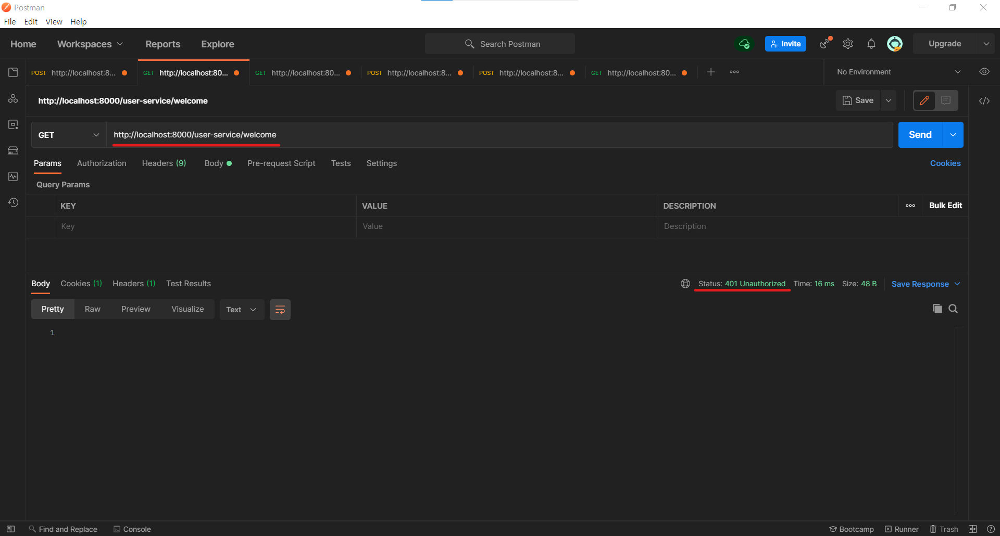
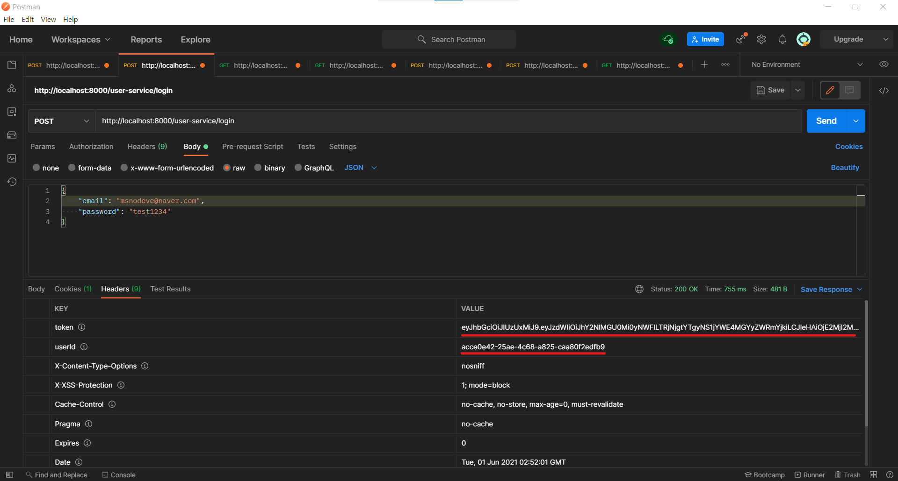
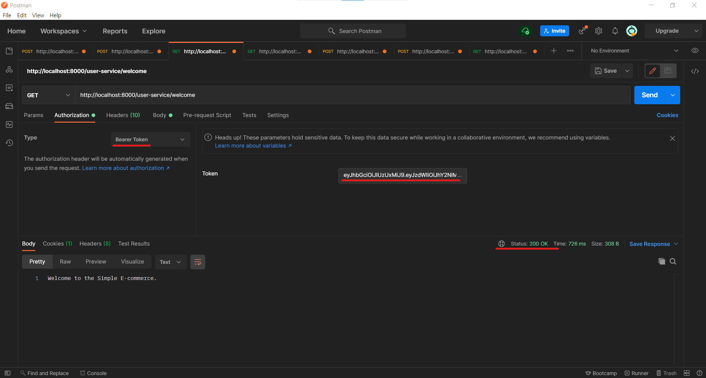

<!-- # Users Microservice

<br><br>

## Branch name
step05/user-microservice

<br><br>

# INDEX -->


<br><br>

# API Gateway

## pom.xml Dependency 추가

> User Service에서 login 요청이 왔을 경우 JWT Token을 발급해 줍니다. <br>
> 이에 API 요청이 API Gateway를 통과할때 해당 Token이 유효한지 확인하기 위해 Dependency를 추가합니다. <br>

```xml
...
<dependency>
    <groupId>io.jsonwebtoken</groupId>
    <artifactId>jjwt</artifactId>
    <version>0.9.1</version>
</dependency>
<dependency>
    <groupId>javax.xml.bind</groupId>
    <artifactId>jaxb-api</artifactId>
</dependency>
...
```

<br>

## application.yml 설정

```yml
# ...

spring:
  application:
    name: apigateway-service
  cloud:
    gateway:
      routes:
        # login 요청에서는 Filter를 거치지 않고 요청할 수 있도록 합니다.
        - id: user-service
          uri: lb://USER-SERVICE
          predicates:
            - Path=/user-service/login
            - Method=POST
          filters:
            - RemoveRequestHeader=Cookie
            - RewritePath=/user-service/(?<segment>.*), /$\{segment}
        # 또한 회원가입 요청에서는 Filter를 거치지 않고 요청할 수 있도록 합니다.
        - id: user-service
          uri: lb://USER-SERVICE
          predicates:
            - Path=/user-service/users
            - Method=POST
          filters:
            - RemoveRequestHeader=Cookie
            - RewritePath=/user-service/(?<segment>.*), /$\{segment}
        # 로그인과 회원가입 이 외 요청이 들어왔을 경우 AuthorizationHeaderFilter를 거치도록 합니다.
        - id: user-service
          uri: lb://USER-SERVICE
          predicates:
            - Path=/user-service/**
            - Method=GET
          filters:
            - RemoveRequestHeader=Cookie
            - RewritePath=/user-service/(?<segment>.*), /$\{segment}
            - AuthorizationHeaderFilter # 이 부분

# ...

token:
  secret: user_token
```

`RewritePath=/user-service/(?<segment>.*), /$\{segment}`
> /user-service/**의 내용을 뒷 부분 즉 ** 부분만 남기고 전달 하겠다는 의미 입니다. <br>
> e.g.) [GET] http://localhost:8000/user-service/users 의 경우 <br>
> > user-service에 http://localhost:[user-service-port]/users 이렇게 변경 됩니다.

## AuthorizationHeaderFilter.java

```java
// AuthorizationHeaderFilter.java

import io.jsonwebtoken.Jwts;
import lombok.extern.slf4j.Slf4j;
import org.apache.http.HttpHeaders;
import org.springframework.beans.factory.annotation.Autowired;
import org.springframework.cloud.gateway.filter.GatewayFilter;
import org.springframework.cloud.gateway.filter.factory.AbstractGatewayFilterFactory;
import org.springframework.core.env.Environment;
import org.springframework.http.HttpStatus;
import org.springframework.http.server.reactive.ServerHttpRequest;
import org.springframework.http.server.reactive.ServerHttpResponse;
import org.springframework.stereotype.Component;
import org.springframework.web.server.ServerWebExchange;
import reactor.core.publisher.Mono;

@Component
@Slf4j
public class AuthorizationHeaderFilter extends AbstractGatewayFilterFactory<AuthorizationHeaderFilter.Config> {

    Environment env;

    @Autowired
    public AuthorizationHeaderFilter(Environment env) {
        super(Config.class);
        this.env = env;
    }

    public static class Config {

    }


    // login -> token -> users (with token) -> header(include token)
    // 토큰이 유효한지 확인 함수
    @Override
    public GatewayFilter apply(Config config) {
        return ((exchange, chain) -> {
            ServerHttpRequest request = exchange.getRequest();

            // 요청의 header 값에 Authorization 키값으로 들어왔는지 확인
            if (!request.getHeaders().containsKey(HttpHeaders.AUTHORIZATION)) {
                // Authorization 키값으로 들어오지 않았다면 Error 반환
                return onError(exchange, "no authorization header", HttpStatus.UNAUTHORIZED);
            }

            // 들어왔을 경우 해당 value 값 저장
            String authorizationHeader = request.getHeaders().get(HttpHeaders.AUTHORIZATION).get(0);

            String jwt = authorizationHeader.replace("Bearer ", "");

            // jwt가 유효한 token 값인지 확인
            if (!isJwtValid(jwt)) {
                // 그렇지 않을 경우 error 반환
                return onError(exchange, "JWT token is not valid", HttpStatus.UNAUTHORIZED);
            }


            return chain.filter(exchange);
        });
    }

    // jwt 토큰이 유효한지 확인하는 함수
    private boolean isJwtValid(String jwt) {
        boolean returnValue = true;

        String subject = null;

        try {

            // 전달 받은 JWT의 내용 parsing
            subject = Jwts.parser().setSigningKey(env.getProperty("token.secret"))
                    .parseClaimsJws(jwt).getBody()
                    .getSubject();

        } catch (Exception ex) {

            returnValue = false;

        }

        if(subject == null || subject.isEmpty()){
            returnValue = false;
        }

        return returnValue;
    }

    // Mono, Flux -> Spring WebFlux
    private Mono<Void> onError(ServerWebExchange exchange, String err, HttpStatus httpStatus) {
        ServerHttpResponse response = exchange.getResponse();
        response.setStatusCode(httpStatus);

        log.error(err);
        return response.setComplete();
    }
}
```

> AbstractGatewayFilterFactory를 상속 받아 구현했습니다.

<br><br><br>

# User Service

## pom.xml Dependency 추가

> Auth Service에서 인증 절차 구현이 필요하지만, 본 문서에서는 User Service에서 구현하도록 함

```xml
...
<dependency>
    <groupId>io.jsonwebtoken</groupId>
    <artifactId>jjwt</artifactId>
    <version>0.9.1</version>
</dependency>
...
```

<br>

## application.yml 설정

```yml
# ...

token:
  expiration_time: 86400000
  secret: user_token
```

> 제일 하단에 token과 관련된 만료 시간 및 암호화할 키값을 작성합니다.

<br>

## User Service, Repository, Impl 구현

```java
import org.springframework.data.repository.CrudRepository;

public interface UserRepository extends CrudRepository<UserEntity, Long> {
    UserEntity findByUserId(String userId);

    UserEntity findByEmail(String username);
}

```

```java
import com.msoogle.userservice.dto.UserDto;
import com.msoogle.userservice.jpa.UserEntity;
import org.springframework.security.core.userdetails.UserDetailsService;

public interface UserService extends UserDetailsService {
    UserDto createUser(UserDto userDto);

    UserDto getUserByUserId(String userId);

    Iterable<UserEntity> getUserByAll();

    UserDto getUserDetailsByEmail(String userName);
}
```

```java
import com.msoogle.userservice.dto.UserDto;
import com.msoogle.userservice.jpa.UserEntity;
import com.msoogle.userservice.jpa.UserRepository;
import com.msoogle.userservice.vo.ResponseOrder;
import org.modelmapper.ModelMapper;
import org.modelmapper.convention.MatchingStrategies;
import org.springframework.beans.factory.annotation.Autowired;
import org.springframework.security.core.userdetails.User;
import org.springframework.security.core.userdetails.UserDetails;
import org.springframework.security.core.userdetails.UsernameNotFoundException;
import org.springframework.security.crypto.bcrypt.BCryptPasswordEncoder;
import org.springframework.stereotype.Service;

import java.util.ArrayList;
import java.util.List;
import java.util.UUID;

@Service
public class UserServiceImpl implements UserService {
    UserRepository userRepository;
    BCryptPasswordEncoder passwordEncoder;


    @Autowired
    public UserServiceImpl(UserRepository userRepository, BCryptPasswordEncoder passwordEncoder) {
        this.userRepository = userRepository;
        this.passwordEncoder = passwordEncoder;
    }

    @Override
    public UserDetails loadUserByUsername(String username) throws UsernameNotFoundException {
        UserEntity userEntity = userRepository.findByEmail(username);

        if (userEntity == null) {
            throw new UsernameNotFoundException(username);
        }

        return new User(userEntity.getEmail(), userEntity.getEncryptedPwd(),
                true, true, true, true,
                new ArrayList<>());
    }

    @Override
    public UserDto createUser(UserDto userDto) {
        userDto.setUserId(UUID.randomUUID().toString());

        ModelMapper mapper = new ModelMapper();
        mapper.getConfiguration().setMatchingStrategy(MatchingStrategies.STRICT);
        UserEntity userEntity = mapper.map(userDto, UserEntity.class);
        userEntity.setEncryptedPwd(passwordEncoder.encode(userDto.getPwd()));

        userRepository.save(userEntity);

        UserDto returnUserDto = mapper.map(userEntity, UserDto.class);

        return returnUserDto;
    }

    @Override
    public UserDto getUserByUserId(String userId) {
        UserEntity userEntity = userRepository.findByUserId(userId);

        if (userEntity == null) {
            throw new UsernameNotFoundException("User not found");
        }

        UserDto userDto = new ModelMapper().map(userEntity, UserDto.class);

        List<ResponseOrder> orders = new ArrayList<>();
        userDto.setOrders(orders);

        return userDto;
    }

    @Override
    public Iterable<UserEntity> getUserByAll() {
        return userRepository.findAll();
    }

    @Override
    public UserDto getUserDetailsByEmail(String email) {
        UserEntity userEntity = userRepository.findByEmail(email);

        if(userEntity == null){
            throw new UsernameNotFoundException(email);
        }

        UserDto userDto = new ModelMapper().map(userEntity, UserDto.class);

        return userDto;
    }
}
```

## WebSecurity, AuthenticationFilter 구현

```java
import com.msoogle.userservice.service.UserService;
import org.springframework.beans.factory.annotation.Autowired;
import org.springframework.context.annotation.Configuration;
import org.springframework.core.env.Environment;
import org.springframework.security.config.annotation.authentication.builders.AuthenticationManagerBuilder;
import org.springframework.security.config.annotation.web.builders.HttpSecurity;
import org.springframework.security.config.annotation.web.configuration.EnableWebSecurity;
import org.springframework.security.config.annotation.web.configuration.WebSecurityConfigurerAdapter;
import org.springframework.security.crypto.bcrypt.BCryptPasswordEncoder;

@Configuration
@EnableWebSecurity
public class WebSecurity extends WebSecurityConfigurerAdapter {
    private UserService userService;
    private BCryptPasswordEncoder bCryptPasswordEncoder;
    private Environment env;

    @Autowired
    public WebSecurity(Environment env, UserService userService, BCryptPasswordEncoder bCryptPasswordEncoder) {
        this.env = env;
        this.userService = userService;
        this.bCryptPasswordEncoder = bCryptPasswordEncoder;
    }

    public WebSecurity(boolean disableDefaults, UserService userService, BCryptPasswordEncoder bCryptPasswordEncoder) {
        super(disableDefaults);
        this.userService = userService;
        this.bCryptPasswordEncoder = bCryptPasswordEncoder;
    }

    @Override
    protected void configure(HttpSecurity http) throws Exception { // 권한 관련
        http.csrf().disable();
//        http.authorizeRequests().antMatchers("/users/**").permitAll();
        http.authorizeRequests().antMatchers("/**")
                .hasIpAddress("[discovery ip]")
        .and()
        .addFilter(getAuthenticationFilter());

        http.headers().frameOptions().disable(); // h2-console 접속 에러 문제 해결
    }

    private AuthenticationFilter getAuthenticationFilter() throws Exception{
        AuthenticationFilter authenticationFilter = new AuthenticationFilter(authenticationManager(), userService, env);
//        authenticationFilter.setAuthenticationManager(authenticationManager());

        return authenticationFilter;
    }

    // select pwd from users where email=?
    // db_pwd(encrypted) == input_pwd(encrypted)
    @Override
    protected void configure(AuthenticationManagerBuilder auth) throws Exception { // 인증 관련
        auth.userDetailsService(userService).passwordEncoder(bCryptPasswordEncoder);
    }
}
```

```java
import com.fasterxml.jackson.databind.ObjectMapper;
import com.msoogle.userservice.dto.UserDto;
import com.msoogle.userservice.service.UserService;
import com.msoogle.userservice.vo.RequestLogin;
import io.jsonwebtoken.Jwts;
import io.jsonwebtoken.SignatureAlgorithm;
import lombok.extern.slf4j.Slf4j;
import org.springframework.core.env.Environment;
import org.springframework.security.authentication.AuthenticationManager;
import org.springframework.security.authentication.UsernamePasswordAuthenticationToken;
import org.springframework.security.core.Authentication;
import org.springframework.security.core.AuthenticationException;
import org.springframework.security.core.userdetails.User;
import org.springframework.security.web.authentication.UsernamePasswordAuthenticationFilter;

import javax.servlet.FilterChain;
import javax.servlet.ServletException;
import javax.servlet.http.HttpServletRequest;
import javax.servlet.http.HttpServletResponse;
import java.io.IOException;
import java.util.ArrayList;
import java.util.Date;

@Slf4j
public class AuthenticationFilter extends UsernamePasswordAuthenticationFilter {

    private UserService userService;
    private Environment env;

    public AuthenticationFilter(AuthenticationManager authenticationManager,
                                UserService userService,
                                Environment env) {
        super.setAuthenticationManager(authenticationManager);
        this.userService = userService;
        this.env = env;
    }

    @Override
    public Authentication attemptAuthentication(HttpServletRequest request,
                                                HttpServletResponse response) throws AuthenticationException {
        try {

            RequestLogin creds = new ObjectMapper().readValue(request.getInputStream(), RequestLogin.class);

            return getAuthenticationManager().authenticate(
                    new UsernamePasswordAuthenticationToken(
                            creds.getEmail(),
                            creds.getPassword(),
                            new ArrayList<>()
                    )
            );
        } catch (IOException e) {
            throw new RuntimeException(e);
        }
    }

    @Override
    protected void successfulAuthentication(HttpServletRequest request,
                                            HttpServletResponse response,
                                            FilterChain chain,
                                            Authentication authResult) throws IOException, ServletException {

        String userName = ((User) authResult.getPrincipal()).getUsername();
        UserDto userDetails = userService.getUserDetailsByEmail(userName);
        String token = Jwts.builder()
                .setSubject(userDetails.getUserId())
                .setExpiration(new Date(System.currentTimeMillis() +
                        Long.parseLong(env.getProperty("token.expiration_time"))))
                .signWith(SignatureAlgorithm.HS512, env.getProperty("token.secret"))
                .compact();

        response.addHeader("token", token);
        response.addHeader("userId", userDetails.getUserId());
    }
}
```

<br><br><br>

# 실행

1. 로그인을 하지 않은 상태에서 http://localhost:8000/user-service/welcome 을 접속하면 401 권한 에러가 발생합니다.
  
2. 로그인을 하게 되면 Header 값에 Token 정보와 User ID 값을 넘겨 받게 됩니다.
  
3. 넘겨 받은 Token 값을 통해 http://localhost:8000/user-service/welcome 을 다시 접속해보면 정상적으로 실행 되는 모습을 확인 할 수 있습니다.
  