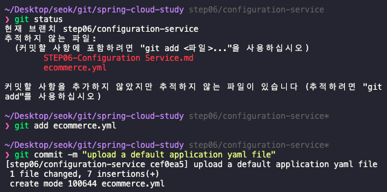
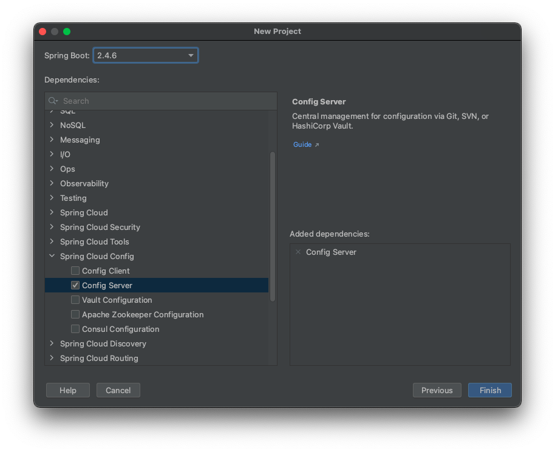
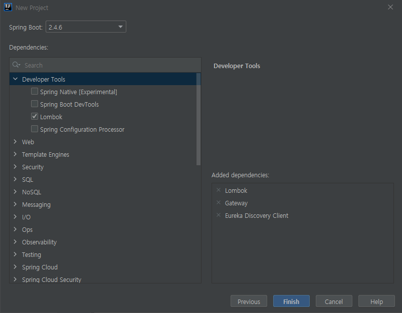
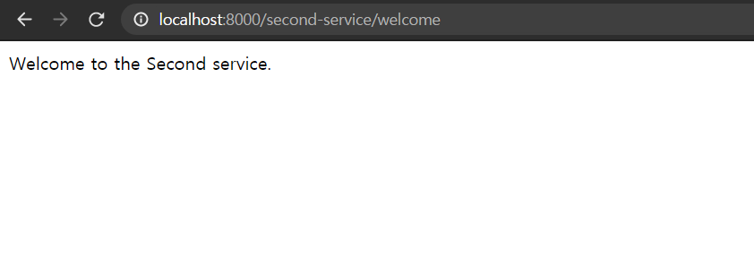
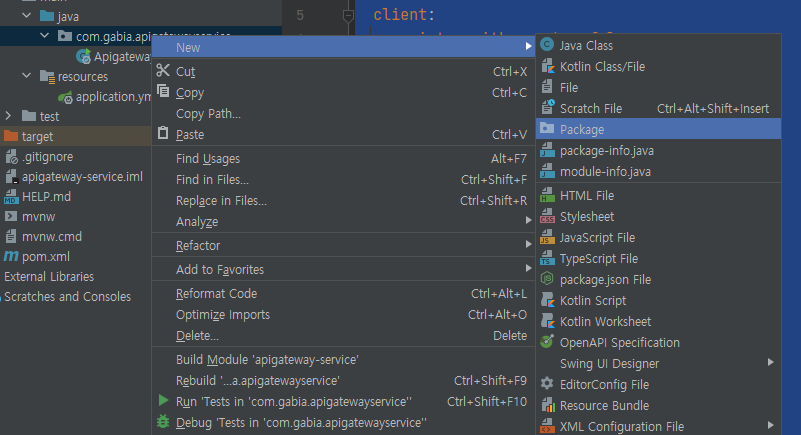
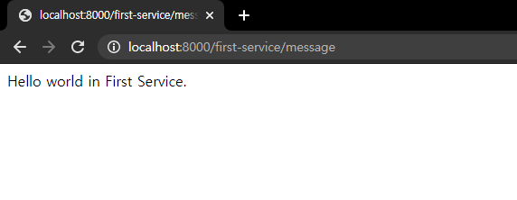
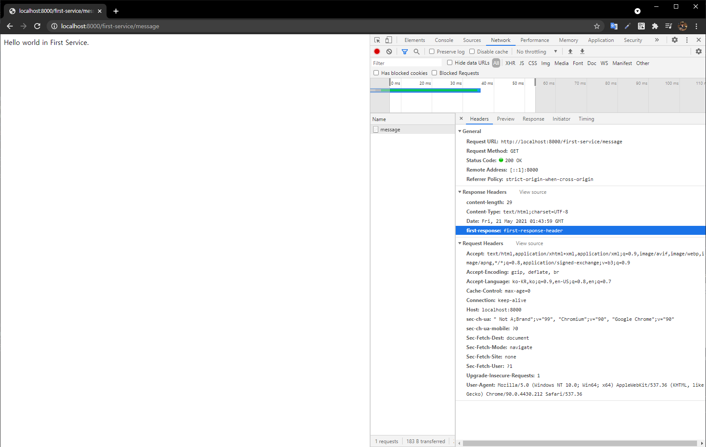
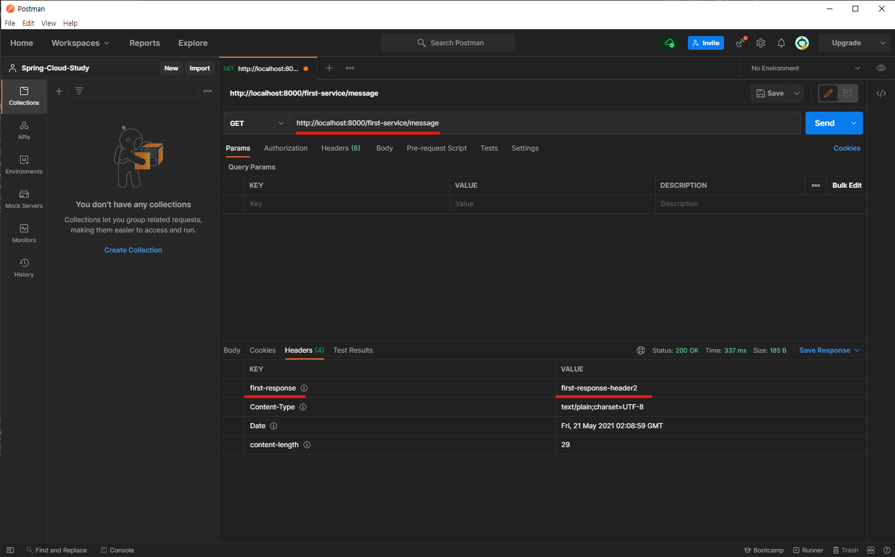
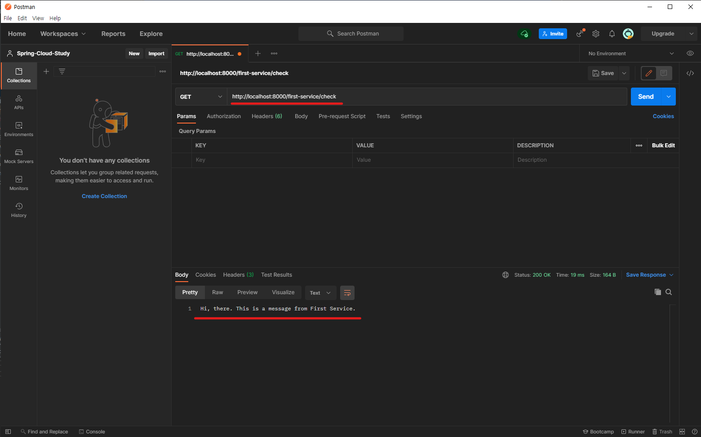
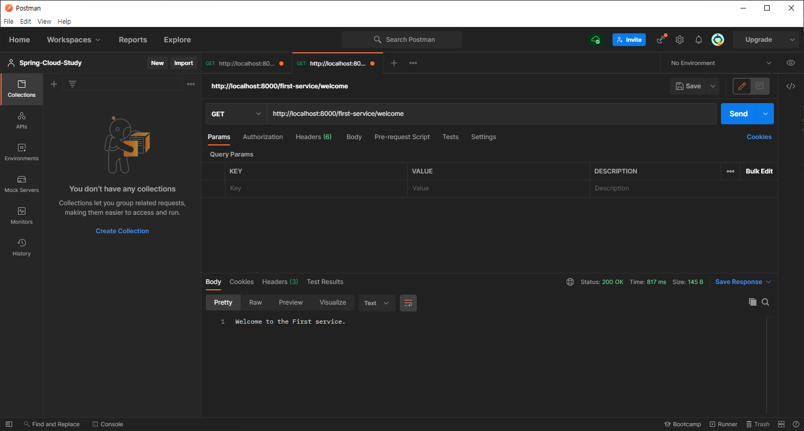

# Configuration Service

<br><br>

## Branch name
step06/configuration-service

<br><br>

# INDEX
<!-- 
### 0.0.1. [1. 사전 Service 생성](#1-사전-service-생성)
  - [1.1. 필요한 Dependency 설치](#11-필요한-dependency-설치)
  - [1.2. application.yml 설정](#12-applicationyml-설정)
  - [1.3. Controller 작성](#13-controller-작성)
### 0.0.2. [2. Spring Cloud Gateway - 프로젝트 생성](#2-spring-cloud-gateway---프로젝트-생성)
  - [2.1. 필요한 Dependency 설치](#21-필요한-dependency-설치)
  - [2.2. 실행](#22-실행)
### 0.0.3. [3. Spring Cloude Gatewaty - Filter(Java Code)를 이용한 방법](#3-spring-cloude-gatewaty---filterjava-code를-이용한-방법)
  - [3.1. application.yml 설정](#31-applicationyml-설정)
  - [3.2. 패키지 생성](#32-패키지-생성)
  - [3.3. FilterConfig.java 생성 및 작성](#33-filterconfigjava-생성-및-작성)
  - [3.4. first, second Service에 추가 작업](#34-first-second-service에-추가-작업)
  - [3.5. 실행](#35-실행)
### 0.0.4. [4. Spring Cloude Gatewaty - Filter(application.yml)를 이용한 방법](#4-spring-cloude-gatewaty---filterapplicationyml를-이용한-방법)
  - [4.1. FilterConfig 파일 주석](#41-filterconfig-파일-주석)
  - [4.2. application.yml 파일 수정](#42-applicationyml-파일-수정)
  - [4.3. 실행](#43-실행)
### [5. Spring Cloud Gateway - Custom Filter 적용](#5-spring-cloud-gateway---custom-filter-적용)
  - [5.1. CustomFilter 생성 및 작성](#51-customfilter-생성-및-작성)
  - [5.2. application.yml 파일에 CustomFilter 등록 및 수정](#52-applicationyml-파일에-customfilter-등록-및-수정)
  - [5.3. first, second-service Controller 수정](#53-first-second-service-controller-수정)
  - [5.4. 실행](#54-실행)
### [6. Spring Cloud Gateway - Global Filter 적용](#6-spring-cloud-gateway---global-filter-적용)
  - [6.1. GlobalFilter 파일 생성 및 작성](#61-globalfilter-파일-생성-및-작성)
  - [6.2. application.yml 파일 수정](#62-applicationyml-파일-수정)
  - [6.3. 실행](#63-실행)
### [7. Spring Cloud Gateway - Logging Filter](#7-spring-cloud-gateway---logging-filter)
  - [7.1. LoggingFilter.java 파일 생성 및 작성](#71-loggingfilterjava-파일-생성-및-작성)
  - [7.2. application.yml 수정](#72-applicationyml-수정)
  - [7.3. 실행](#73-실행)
### [8. Spring Cloud Gateway - Load Balancer (Eureka 연동)](#8-spring-cloud-gateway---load-balancer-eureka-연동)
  - [8.1. 실행](#81-실행) -->

<br><br><br>

# 1. 사전 ecommerce.yml 파일 생성 및 버전 관리

> 원하는 빈 폴더의 공간에 `ecommerce.yml` 파일을 생성 후 다음과 같이 작성 합니다.

```yml
token:
  expiration_time: 86400000
  secret: user_token

gateway:
  ip: 192.168.0.3 # local ip address
```

> 해당 내용은 user-service yml 파일의 정보 입니다.

그리고 git 형상관리를 하기 위해 `add` 및 `commit`을 합니다.



```bash
$ git add ecommerce.yml

$ git commit -m "upload a default application yaml file"
```

<br><br>

## 필요한 Dependency 설치

- Config Server <br>



<br><br>

## 1.2. application.yml 설정

- first-service는 8081번 포트로 
- second-service는 8082번 포트로

```yml
server:
  port: 8081 # 8082

spring:
  application:
    name: my-first-service # my-second-service

eureka:
  client:
    fetch-registry: false
    register-with-eureka: false
```

<br><br>

## 1.3. Controller 작성

- 각 프로젝트에 FirstServiceController와 SecondServiceController 각각 생성합니다.

```java
import org.springframework.web.bind.annotation.GetMapping;
import org.springframework.web.bind.annotation.RequestMapping;
import org.springframework.web.bind.annotation.RestController;

@RestController
@RequestMapping("/first-service") // @RequestMapping("/second-service")
public class FirstServiceController { // SecondServiceController
    @GetMapping("/welcome")
    public String welcome(){
        return "Welcome to the First service."; // return "Welcome to the Second service."; 
    }
}
```

각 Service 들을 실행합니다.

<br><br><br>

# 2. Spring Cloud Gateway - 프로젝트 생성

## 2.1. 필요한 Dependency 설치
- Eureka Discovery Client <br>
- Lombok <br>
- Gateway <br>



<br><br>

## 2.2. 실행

브라우저에서 다음을 접속 합니다.
- http://localhost:8000/first-service/welcome
- http://localhost:8000/second-service/welcome

 


<br><br><br>

# 3. Spring Cloude Gatewaty - Filter(Java Code)를 이용한 방법

## 3.1. application.yml 설정

> 이번에는 Java code로 route를 설정해보는 방법을 알아봅니다. <br>
> 따라서 API Gateway Service 프로젝트의 application.yml에 작성해둔 route는 주석처리합니다. <br>

```yml
server:
  port: 8000

eureka:
  client:
    register-with-eureka: false
    fetch-registry: false
    service-url:
      defalutZone: http://localhost:8761/eureka

spring:
  application:
    name: apigateway-service
#  cloud:
#    gateway:
#      routes:
#        - id: first-service
#          uri: http://localhost:8081/
#          predicates:
#            - Path=/first-service/**
#        - id: second-service
#          uri: http://localhost:8082/
#          predicates:
#            - Path=/second-service/**

```

<br><br>

## 3.2. 패키지 생성

> Filter를 작성할 패키지를 생성합니다.

 

패키지 이름은 `config`라고 하겠습니다.


<br><br>

## 3.3. FilterConfig.java 생성 및 작성

```java
import org.springframework.cloud.gateway.route.RouteLocator;
import org.springframework.cloud.gateway.route.builder.RouteLocatorBuilder;
import org.springframework.context.annotation.Bean;
import org.springframework.context.annotation.Configuration;

@Configuration
public class FilterConfig {
    
    @Bean
    public RouteLocator gatewayRoutes(RouteLocatorBuilder builder) {
        return builder.routes()
                .route(r -> r.path("/first-service/**")
                        .filters(f -> f.addRequestHeader("first-request", "first-request-header")
                                .addResponseHeader("first-response", "first-response-header"))
                        .uri("http://localhost:8081"))
                .route(r -> r.path("/second-service/**")
                        .filters(f -> f.addRequestHeader("second-request", "second-request-header")
                                .addResponseHeader("second-response", "second-response-header"))
                        .uri("http://localhost:8082"))
                .build();
    }
}
```

JDK8 이상의 버전부터 Lambda를 사용해 route를 적용했습니다.
```java
.route(r -> r.path("/first-service/**") // 1. 어떠한 Path로 요청이 들어왔을 경우
             .filters(f -> f.addRequestHeader("first-request", "first-request-header")      // 3. Request 헤더에는 key-value 값으로 들어오는지
                            .addResponseHeader("first-response", "first-response-header")) // 3. Response 헤더에는 key-value 으로 Client에게 반환 할 것인지
             .uri("http://localhost:8081")) // 2. 해당 uri 값으로 Redirect 해주며
```


<br><br>

## 3.4. first, second Service에 추가 작업

```java
import lombok.extern.slf4j.Slf4j;
import org.springframework.web.bind.annotation.GetMapping;
import org.springframework.web.bind.annotation.RequestHeader;
import org.springframework.web.bind.annotation.RequestMapping;
import org.springframework.web.bind.annotation.RestController;

@Slf4j
@RestController
@RequestMapping("/first-service")
public class FirstServiceController {
    @GetMapping("/welcome")
    public String welcome(){
        return "Welcome to the First service.";
    }

    @GetMapping("/message")
    public String message(@RequestHeader("first-request") String header){ // @RequestHeader("second-request")
        log.info(header);
        return "Hello world in First Service."; // return "Hello world in Second Service.";
    }
}

```

<br><br>


## 3.5. 실행

브라우저에서 다음을 접속 합니다.
- http://localhost:8000/first-service/message
- http://localhost:8000/second-service/message



잘 출력 되는 모습을 볼 수 있으며, 추가적으로 first, second-service의 `Console` log를 보시면 다음과 같이 요청 값을 잘 출력한 모습을 확인 할 수 있습니다.
```
...
2021-05-21 10:40:16.254  INFO 6484 --- [nio-8081-exec-1] o.s.web.servlet.DispatcherServlet        : Completed initialization in 6 ms
2021-05-21 10:40:16.284  INFO 6484 --- [nio-8081-exec-1] c.g.firstservice.FirstServiceController  : first-request-header
```

또한 Response Header는 다음과 같이 확인 할 수 있습니다.



<br><br><br>

# 4. Spring Cloude Gatewaty - Filter(application.yml)를 이용한 방법

## 4.1. FilterConfig 파일 주석

- @Configuration
- @Bean

```java
import org.springframework.cloud.gateway.route.RouteLocator;
import org.springframework.cloud.gateway.route.builder.RouteLocatorBuilder;
import org.springframework.context.annotation.Bean;
import org.springframework.context.annotation.Configuration;

//@Configuration
public class FilterConfig {
//    @Bean
    public RouteLocator gatewayRoutes(RouteLocatorBuilder builder) {
        return builder.routes()
                .route(r -> r.path("/first-service/**")
                        .filters(f -> f.addRequestHeader("first-request", "first-request-header")
                                .addResponseHeader("first-response", "first-response-header"))
                        .uri("http://localhost:8081"))
                .route(r -> r.path("/second-service/**")
                        .filters(f -> f.addRequestHeader("second-request", "second-request-header")
                                .addResponseHeader("second-response", "second-response-header"))
                        .uri("http://localhost:8082"))
                .build();
    }
}
```

<br><br>

## 4.2. application.yml 파일 수정

```yml
server:
  port: 8000

eureka:
  client:
    register-with-eureka: false
    fetch-registry: false
    service-url:
      defalutZone: http://localhost:8761/eureka

spring:
  application:
    name: apigateway-service
  cloud:
    gateway:
      routes:
        - id: first-service
          uri: http://localhost:8081/
          predicates:
            - Path=/first-service/**
          filters:
            - AddRequestHeader=first-request, first-request-header2
            - AddResponseHeader=first-request, first-response-header2
        - id: second-service
          uri: http://localhost:8082/
          predicates:
            - Path=/second-service/**
          filters:
            - AddRequestHeader=second-request, second-request-header2
            - AddResponseHeader=second-request, second-response-header2
```

<br><br>

## 4.3. 실행

> Postman을 사용했으며 결과는 다음과 같습니다.




<br><br><br>

# 5. Spring Cloud Gateway - Custom Filter 적용

## 5.1. CustomFilter 생성 및 작성

`[package]/CustomFilter.java` 생성 후 다음 코드 작성

```java
import lombok.extern.slf4j.Slf4j;
import org.springframework.cloud.gateway.filter.GatewayFilter;
import org.springframework.cloud.gateway.filter.factory.AbstractGatewayFilterFactory;
import org.springframework.http.server.reactive.ServerHttpRequest;
import org.springframework.http.server.reactive.ServerHttpResponse;
import org.springframework.stereotype.Component;
import reactor.core.publisher.Mono;

@Component
@Slf4j
public class CustomFilter extends AbstractGatewayFilterFactory<CustomFilter.Config> {

    public CustomFilter() {
        super(Config.class);
    }

    public static class Config {
        // Put the configuration properties
    }

    @Override
    public GatewayFilter apply(Config config) {
        // Custom Pre Filter
        return (exchange, chain) -> {
            ServerHttpRequest request = exchange.getRequest();
            ServerHttpResponse response = exchange.getResponse();

            log.info("Custom PRE filter: request id -> {}", request.getId());

            // Custom Post Filter
            return chain.filter(exchange).then(Mono.fromRunnable(() -> {
                log.info("Custom POST filter: response code -> {}", response.getStatusCode());
            }));
        };
    }
}
```

<br><br>

## 5.2. application.yml 파일에 CustomFilter 등록 및 수정

```yml
server:
  port: 8000

eureka:
  client:
    register-with-eureka: false
    fetch-registry: false
    service-url:
      defalutZone: http://localhost:8761/eureka

spring:
  application:
    name: apigateway-service
  cloud:
    gateway:
      routes:
        - id: first-service
          uri: http://localhost:8081/
          predicates:
            - Path=/first-service/**
          filters:
#            - AddRequestHeader=first-request, first-request-header2
#            - AddResponseHeader=first-response, first-response-header2
            - CustomFilter
        - id: second-service
          uri: http://localhost:8082/
          predicates:
            - Path=/second-service/**
          filters:
#            - AddRequestHeader=second-request, second-request-header2
#            - AddResponseHeader=second-response, second-response-header2
            - CustomFilter
```

<br><br>

## 5.3. first, second-service Controller 수정

```java
import lombok.extern.slf4j.Slf4j;
import org.springframework.web.bind.annotation.GetMapping;
import org.springframework.web.bind.annotation.RequestHeader;
import org.springframework.web.bind.annotation.RequestMapping;
import org.springframework.web.bind.annotation.RestController;

@Slf4j
@RestController
@RequestMapping("/first-service")
public class FirstServiceController {
    @GetMapping("/welcome")
    public String welcome(){
        return "Welcome to the First service.";
    }

    @GetMapping("/message")
    public String message(@RequestHeader("first-request") String header){
        log.info(header);
        return "Hello world in First Service.";
    }

    @GetMapping("/check")
    public String check(){
        return "Hi, there. This is a message from First Service."; // return "Hi, there. This is a message from Second Service.";
    }
}
```

<br><br>

## 5.4. 실행

> Postman을 사용했으며 결과는 다음과 같습니다.



```
...
2021-05-21 11:39:52.850  INFO 13896 --- [ctor-http-nio-3] c.g.a.filter.CustomFilter                : Custom PRE filter: request id -> 63f0efb0-3
2021-05-21 11:39:52.862  INFO 13896 --- [ctor-http-nio-3] c.g.a.filter.CustomFilter                : Custom POST filter: response code -> 200 OK
```


<br><br><br>

# 6. Spring Cloud Gateway - Global Filter 적용

> Custom Filter 처럼 각각 하나하나씩 등록하기 보다 전체적으로 똑같이 Filter를 적용하고 싶다면 Global Filter를 사용하면 됩니다.

## 6.1. GlobalFilter 파일 생성 및 작성
```java
import lombok.Data;
import lombok.extern.slf4j.Slf4j;
import org.springframework.cloud.gateway.filter.GatewayFilter;
import org.springframework.cloud.gateway.filter.factory.AbstractGatewayFilterFactory;
import org.springframework.http.server.reactive.ServerHttpRequest;
import org.springframework.http.server.reactive.ServerHttpResponse;
import org.springframework.stereotype.Component;
import reactor.core.publisher.Mono;

@Component
@Slf4j
public class GlobalFilter extends AbstractGatewayFilterFactory<GlobalFilter.Config> {

    public GlobalFilter() {
        super(Config.class);
    }

    @Data
    public static class Config {
        private String baseMessage;
        private boolean preLogger;
        private boolean postLogger;
    }

    @Override
    public GatewayFilter apply(Config config) {
        // Custom Pre Filter
        return (exchange, chain) -> {
            ServerHttpRequest request = exchange.getRequest();
            ServerHttpResponse response = exchange.getResponse();

            log.info("Global Filter baseMessage: {}", config.getBaseMessage());

            if(config.isPreLogger()){
                log.info("Global Filter Start: request id -> {}", request.getId());
            }

            // Custom Post Filter
            return chain.filter(exchange).then(Mono.fromRunnable(() -> {
                if(config.isPostLogger()){
                    log.info("Global Filter End: response code -> {}", response.getStatusCode());
                }
            }));
        };
    }
}
```

<br><br>

## 6.2. application.yml 파일 수정
```yml
server:
  port: 8000

eureka:
  client:
    register-with-eureka: false
    fetch-registry: false
    service-url:
      defalutZone: http://localhost:8761/eureka

spring:
  application:
    name: apigateway-service
  cloud:
    gateway:
      routes:
        - id: first-service
          uri: http://localhost:8081/
          predicates:
            - Path=/first-service/**
          filters:
#            - AddRequestHeader=first-request, first-request-header2
#            - AddResponseHeader=first-response, first-response-header2
            - CustomFilter
        - id: second-service
          uri: http://localhost:8082/
          predicates:
            - Path=/second-service/**
          filters:
#            - AddRequestHeader=second-request, second-request-header2
#            - AddResponseHeader=second-response, second-response-header2
            - CustomFilter
      default-filters:
        - name: GlobalFilter
          args:
            baseMessage: Spring Cloud Gateway Global Filter
            preLogger: true
            postLogger: true
```

<br><br>

## 6.3. 실행

> Postman을 사용했으며 <br>
> http://localhost:8000/first-service/check <br>
> http://localhost:8000/second-service/check <br>
> 를 요청한 결과는 다음과 같습니다. <br>

```
2021-05-21 16:04:54.688  INFO 19008 --- [ctor-http-nio-3] c.g.a.filter.GlobalFilter                : Global Filter baseMessage: Spring Cloud Gateway Global Filter
2021-05-21 16:04:54.688  INFO 19008 --- [ctor-http-nio-3] c.g.a.filter.GlobalFilter                : Global Filter Start: request id -> cf83a0de-1
2021-05-21 16:04:54.688  INFO 19008 --- [ctor-http-nio-3] c.g.a.filter.CustomFilter                : Custom PRE filter: request id -> cf83a0de-1
2021-05-21 16:04:55.046  INFO 19008 --- [ctor-http-nio-5] c.g.a.filter.CustomFilter                : Custom POST filter: response code -> 200 OK
2021-05-21 16:04:55.046  INFO 19008 --- [ctor-http-nio-5] c.g.a.filter.GlobalFilter                : Global Filter End: response code -> 200 OK
2021-05-21 16:05:30.909  INFO 19008 --- [ctor-http-nio-3] c.g.a.filter.GlobalFilter                : Global Filter baseMessage: Spring Cloud Gateway Global Filter
2021-05-21 16:05:30.909  INFO 19008 --- [ctor-http-nio-3] c.g.a.filter.GlobalFilter                : Global Filter Start: request id -> cf83a0de-2
2021-05-21 16:05:30.910  INFO 19008 --- [ctor-http-nio-3] c.g.a.filter.CustomFilter                : Custom PRE filter: request id -> cf83a0de-2
2021-05-21 16:05:31.624  INFO 19008 --- [ctor-http-nio-3] c.g.a.filter.CustomFilter                : Custom POST filter: response code -> 200 OK
2021-05-21 16:05:31.625  INFO 19008 --- [ctor-http-nio-3] c.g.a.filter.GlobalFilter                : Global Filter End: response code -> 200 OK
```


<br><br><br>

# 7. Spring Cloud Gateway - Logging Filter

## 7.1. LoggingFilter.java 파일 생성 및 작성
```java
import lombok.Data;
import lombok.extern.slf4j.Slf4j;
import org.springframework.cloud.gateway.filter.GatewayFilter;
import org.springframework.cloud.gateway.filter.OrderedGatewayFilter;
import org.springframework.cloud.gateway.filter.factory.AbstractGatewayFilterFactory;
import org.springframework.core.Ordered;
import org.springframework.http.server.reactive.ServerHttpRequest;
import org.springframework.http.server.reactive.ServerHttpResponse;
import org.springframework.stereotype.Component;
import reactor.core.publisher.Mono;

@Component
@Slf4j
public class LoggingFilter extends AbstractGatewayFilterFactory<LoggingFilter.Config> {

    public LoggingFilter() {
        super(Config.class);
    }

    @Data
    public static class Config {
        private String baseMessage;
        private boolean preLogger;
        private boolean postLogger;
    }

    @Override
    public GatewayFilter apply(Config config) {
        GatewayFilter filter = new OrderedGatewayFilter((exchange, chain) -> {
            ServerHttpRequest request = exchange.getRequest();
            ServerHttpResponse response = exchange.getResponse();

            log.info("Logging Filter baseMessage: {}", config.getBaseMessage());

            if(config.isPreLogger()){
                log.info("Logging PRE Filter: request id -> {}", request.getId());
            }

            // Custom Post Filter
            return chain.filter(exchange).then(Mono.fromRunnable(() -> {
                if(config.isPostLogger()){
                    log.info("Logging POST Filter: response code -> {}", response.getStatusCode());
                }
            }));
        }, Ordered.LOWEST_PRECEDENCE);

        return filter;
    }
}
```

> OrderedGatewayFilter 클래스에서 2번째 인자에 의해서 Filter의 순서가 결정 됩니다. <br>
> 현재 Ordered.LOWEST_PRECEDENCE로 되어있기 때문에 제일 마지막에 실행되며, <br>
> Ordered.HIGHEST_PRECEDENCE로 되어있다면 제일 처음 실행됩니다. <br>

<br><br>

## 7.2. application.yml 수정

```yml
server:
  port: 8000

eureka:
  client:
    register-with-eureka: false
    fetch-registry: false
    service-url:
      defalutZone: http://localhost:8761/eureka

spring:
  application:
    name: apigateway-service
  cloud:
    gateway:
      routes:
        - id: first-service
          uri: http://localhost:8081/
          predicates:
            - Path=/first-service/**
          filters:
#            - AddRequestHeader=first-request, first-request-header2
#            - AddResponseHeader=first-response, first-response-header2
            - CustomFilter
        - id: second-service
          uri: http://localhost:8082/
          predicates:
            - Path=/second-service/**
          filters:
#            - AddRequestHeader=second-request, second-request-header2
#            - AddResponseHeader=second-response, second-response-header2
            - name: CustomFilter
            - name: LoggingFilter
              args:
                baseMessage: Hi,  there.
                preLogger: true
                postLogger: true
      default-filters:
        - name: GlobalFilter
          args:
            baseMessage: Spring Cloud Gateway Global Filter
            preLogger: true
            postLogger: true
```

> first-service에는 LoggingFilter를 적용하지 않았으며, <br>
> second-service에만 LoggingFilter를 적용했습니다.

<br><br>

## 7.3. 실행

> Postman을 사용했으며 <br>
> http://localhost:8000/first-service/check <br>
> http://localhost:8000/second-service/check <br>
> 를 요청한 결과는 다음과 같습니다. <br>

```
2021-05-21 16:23:37.588  INFO 19964 --- [ctor-http-nio-3] c.g.a.filter.GlobalFilter                : Global Filter baseMessage: Spring Cloud Gateway Global Filter
2021-05-21 16:23:37.588  INFO 19964 --- [ctor-http-nio-3] c.g.a.filter.GlobalFilter                : Global Filter Start: request id -> 61e05d69-1
2021-05-21 16:23:37.588  INFO 19964 --- [ctor-http-nio-3] c.g.a.filter.CustomFilter                : Custom PRE filter: request id -> 61e05d69-1
2021-05-21 16:23:37.764  INFO 19964 --- [ctor-http-nio-5] c.g.a.filter.CustomFilter                : Custom POST filter: response code -> 200 OK
2021-05-21 16:23:37.764  INFO 19964 --- [ctor-http-nio-5] c.g.a.filter.GlobalFilter                : Global Filter End: response code -> 200 OK
2021-05-21 16:23:38.694  INFO 19964 --- [ctor-http-nio-3] c.g.a.filter.GlobalFilter                : Global Filter baseMessage: Spring Cloud Gateway Global Filter
2021-05-21 16:23:38.694  INFO 19964 --- [ctor-http-nio-3] c.g.a.filter.GlobalFilter                : Global Filter Start: request id -> 61e05d69-2
2021-05-21 16:23:38.694  INFO 19964 --- [ctor-http-nio-3] c.g.a.filter.CustomFilter                : Custom PRE filter: request id -> 61e05d69-2
2021-05-21 16:23:38.706  INFO 19964 --- [ctor-http-nio-3] c.g.a.filter.LoggingFilter               : Logging Filter baseMessage: Hi,  there.
2021-05-21 16:23:38.706  INFO 19964 --- [ctor-http-nio-3] c.g.a.filter.LoggingFilter               : Logging PRE Filter: request id -> 61e05d69-2
2021-05-21 16:23:38.707  INFO 19964 --- [ctor-http-nio-3] c.g.a.filter.LoggingFilter               : Logging POST Filter: response code -> 200 OK
2021-05-21 16:23:38.707  INFO 19964 --- [ctor-http-nio-3] c.g.a.filter.CustomFilter                : Custom POST filter: response code -> 200 OK
2021-05-21 16:23:38.707  INFO 19964 --- [ctor-http-nio-3] c.g.a.filter.GlobalFilter                : Global Filter End: response code -> 200 OK
```


<br><br><br>

# 8. Spring Cloud Gateway - Load Balancer (Eureka 연동)

> Eureka에 등록하기 위해서 <br>
> 1. API Gateway Service <br>
> 2. First Service <br>
> 3. Secon Service <br>
> 
> 모두 `pom.xml` 에 다음 Dependency가 포함 되어야 합니다.

```xml
<dependency>
    <groupId>org.springframework.cloud</groupId>
    <artifactId>spring-cloud-starter-netflix-eureka-client</artifactId>
</dependency>
```

> 또한 application.yml 파일에 eureka 등록을 설정해야합니다.

```yml
...
eureka:
  client:
    fetch-registry: true
    register-with-eureka: true
    service-url:
      defaultZone: http://localhost:8761/eureka
...
```

> 마지막으로 `API Gateway Service`의 `application.yml` 파일에 uri 부분을 변경합니다.

```yml
 routes:
    - id: first-service
        uri: lb://MY-FIRST-SERVICE # 이 부분
        predicates:
        - Path=/first-service/** 
        filters:
        - CustomFilter
    - id: second-service
        uri: lb://MY-SECOND-SERVICE # 이 부분
        predicates:
        - Path=/second-service/**
        filters:
        - name: CustomFilter
        - name: LoggingFilter
            args:
            baseMessage: Hi,  there.
            preLogger: true
            postLogger: true
```

<br><br>

## 8.1. 실행

> Postman을 사용했으며 <br>
> http://localhost:8000/first-service/welcome <br>
> http://localhost:8000/second-service/welcome <br>
> 를 요청해보면 결과를 받아 볼 수 있습니다.


